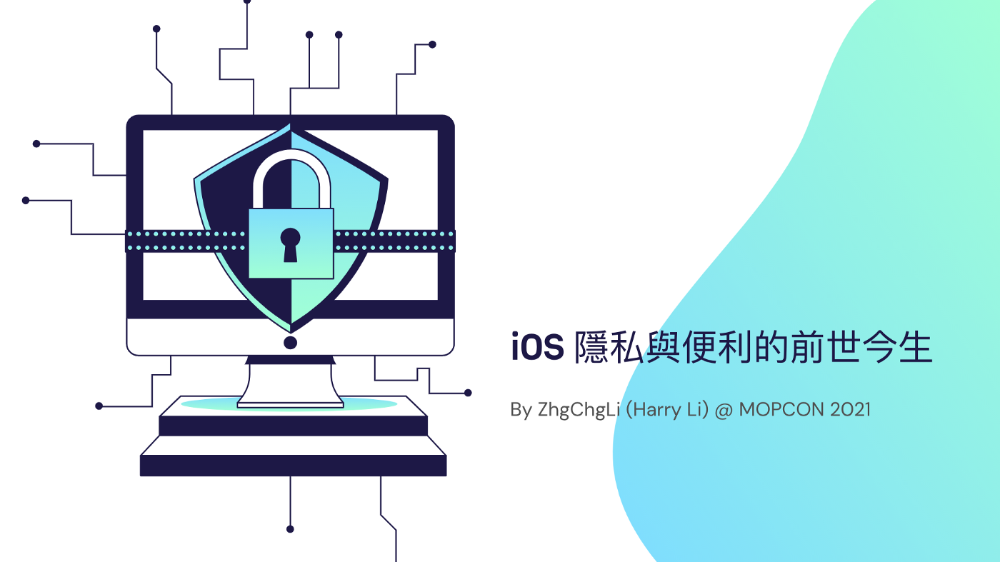
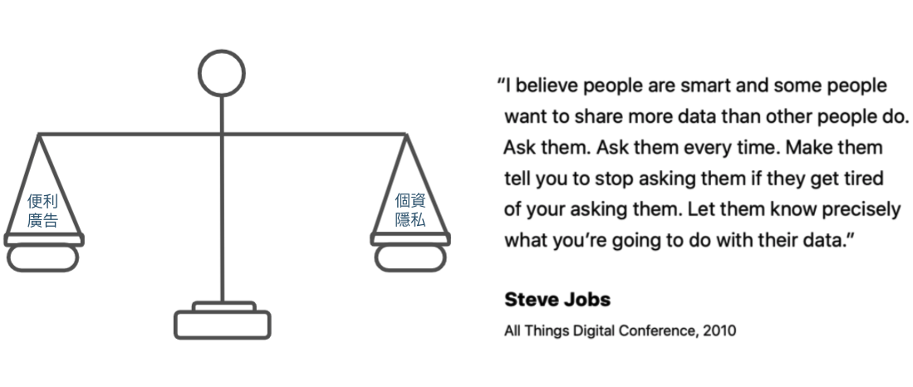
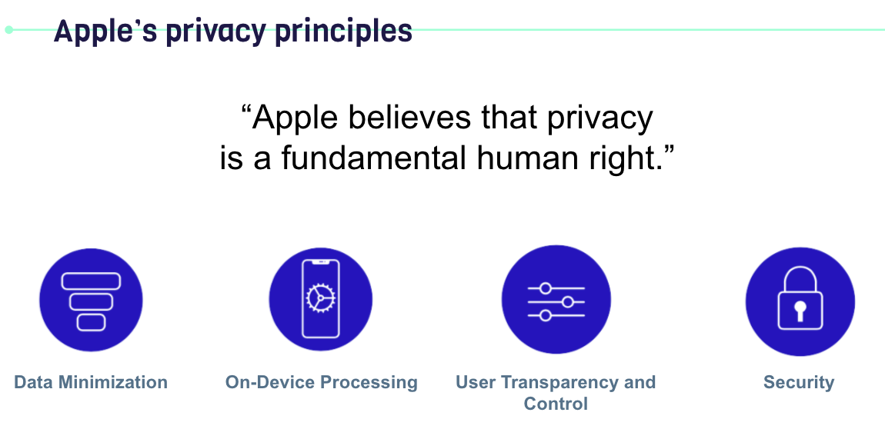
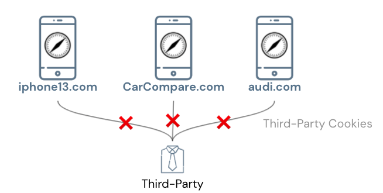
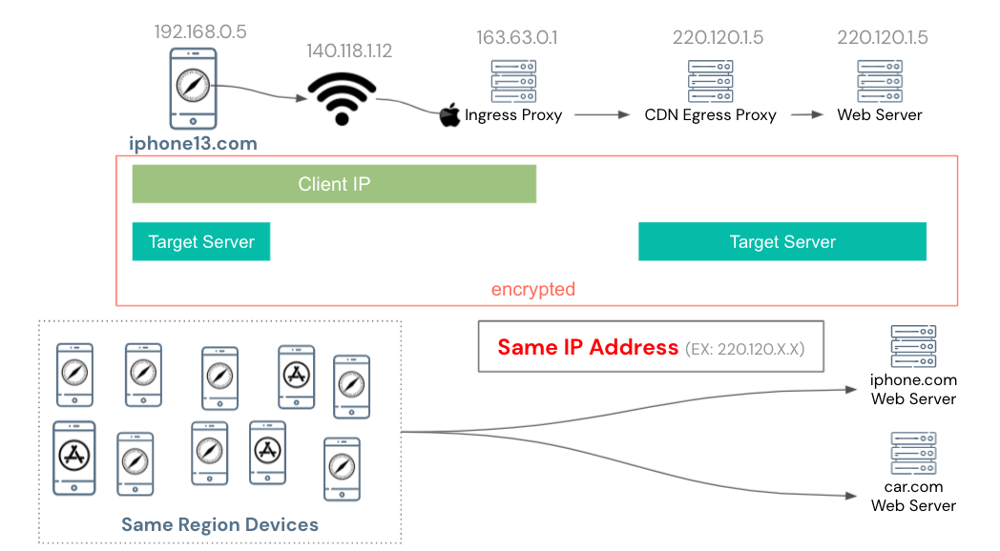

### iOS 隱私與便利的前世今生
Apple 隱私原則及 iOS 歷年對隱私保護的功能調整

### 前言
這次很榮幸能參加 MOPCON 演講，但因疫情關係改成線上直播形式蠻遺憾的，無法認識更多新朋友；這次演講的主題是「iOS 隱私與便利的前世今生」主要想跟大家分享 Apple 關於隱私的原則及這些年來 iOS 基於這些隱私原則所做的功能調整。

相信這幾年開發者或是 iPhone 用戶應該都對以下功能調整並不陌生：

- iOS ≥ 13：所有支援第三方登入的 App 都需要多實作 Sign in with Apple，否則無法成功上架 App
- iOS ≥ 14：剪貼簿存取警告
- iOS ≥ 14.5：IDFA 必須允許後才能存取，幾乎等同封殺 IDFA
- iOS ≥ 15：Private Relay，使用 Proxy 隱藏使用者原始 IP 位址
- ….還有很多很多，會在文章後跟大家分享
#### Why?
如果不清楚 Apple 的隱私原則，甚至會覺得為何 Apple 這幾年不斷地在跟開發者、廣告商作對？很多大家用得很習慣的功能都被封鎖了。
再追完「WWDC 2021 — Apple’s privacy pillars in focus」及「Apple privacy white paper — A Day in the Life of Your Data」兩份文件後如夢初醒，原來我們早已在不知不覺中洩漏許多個人隱私並且讓廣告商或社群媒體賺的盆滿缽滿，在我們的日常生活中已經達到無孔不入的境界。
參考 Apple privacy white paper 改寫，以下以虛構人物哈里為例；為大家講述隱私是如何洩漏的及可能造成的危害。

左邊是網頁瀏覽紀錄：可以看到分別造訪了跟車子、iPhone 13、精品有關的網站
右邊是已安裝的 App：有投資、旅遊、社交、購物、還有嬰兒攝影機…這些 App

線下活動會留下記錄的地方例如：發票、信用卡刷卡紀錄、行車記錄器…等等
#### 組合
你可能會想說，我瀏覽不同的網站、裝不同的 App (甚至根本沒登入)、再到線下活動怎麼可能有機會讓某個服務串起所有資料？
答案是：就技術手段是有的，而且「可能」或是「已經」局部發生。

如上圖所示：
- 未登入時網站與網站之間可以透過 Third-Party Cookie、IP Address + 裝置資訊算出的 Fingerprint 在不同網站中識別出同個瀏覽者。
- 登入時網站與網站之間可以透過註冊資料，如姓名、生日、電話、Email、身分證字號…串起你的資料
- App 與 App 之間可以透過取得 Device UUID 在不同 App 中識別出同個使用者、URL Scheme 嗅探手機上其他已安裝的 App、Pasteboard 在 App 與 App 間傳遞資料；另外一樣也可在使用者登入後用註冊資料串起資料。
- App 與網站之間同樣可以用 Third-Party Cookie、Fingerprint、Pasteboard 傳遞資料
- 線上與線下活動的串連可能發生在，銀行端蒐集信用卡消費記錄、記帳 App、發票蒐集 App、行車記錄器 App…等等，都有機會把線下活動與線上資料串接在一起
> 事實證明，技術上是可行的；那究竟躲在所有網站、App 之後的第三方是誰呢？
諸如家大業大的 Facebook、Google 都靠個人廣告獲得不少收益；許多網站、App 也都會串接 Facebook、Google SDK…所以一切都很難說，這還是看得到，更多時候我們根本不知道網站、App 用了哪些第三方廣告、數據蒐集服務，在背後偷偷紀錄著我們的一舉一動。
我們假設哈里所有的活動，背後都偷藏著同一個第三方在默默收集他的資料，那麼在它的眼裡，哈里可能的輪廓如下：

左邊是個人資料，可能來自網站註冊資料、外送資料；右邊是依照哈里的活動紀錄打上的行為、興趣標籤。

在它眼中的哈里，可能比哈里還更了解自己；這些資料用在社交媒體，可以讓使用者更加沈淪；用在廣告上，可以刺激哈里過度消費或是營造鳥籠效應(EX: 推薦你買新褲子，你買了褲子就會買合適的鞋子來穿搭，買了鞋子就會再買襪子…沒完沒了)。
如果你覺得以上已經夠可怕了，還有更可怕的：

有你的個人資料又知道你的經濟狀況…要做惡的話不敢想像，例如：綁架、竊盜…
#### 目前的隱私保護方式
- 法律規範 (EX: SGS-BS10012 個資驗證、CCPA、GDPR…)
- 隱私權協議、去識別化
主要還是透過法規約束；很難確保服務 100% 隨時遵守、網路上惡意程式也很多也難保證服務不會被駭造成資料外洩；總之還是「要做惡技術上都可行，單靠法規跟企業良心約束」。
除此之外更多時候，我們是「被迫」接受隱私權條款的，無法針對個別隱私授權，要馬整個服務都不用，要馬就是用但要接受全部隱私權條款；還有隱私條款不透明，不知道會怎麼被收集及應用，更不知道背後有沒有還躲著一個第三方在你根本不知道情況下蒐集你的資料。
另外 Apple 還有提到關於未成年人的個人隱私，多半也都在監護人未同意的情況下被服務蒐集。
### Apple’s privacy principles
知道個人隱私洩露帶來的危害之後，來看一下蘋果的隱私原則。

節錄自 Apple Privacy White Paper 蘋果的理想不是完全封殺而是平衡，例如這幾年很多人都會直接裝 AD Block 完全阻斷廣告，這也不是蘋果想看到的；因為如果完全斷開就很難做出更好的服務。
賈伯斯在 2010 年的 All Things Digital Conference 說過：
> 我相信人是聰明的，有些人會比其他人更想分享數據，每次都去問他們，讓他們煩到叫你不要再問他們了，讓他們精準的知道你要怎麼使用他們的資料。 — translate by Chun-Hsiu Liu

> 蘋果相信隱私是基本人權
#### 蘋果的四個隱私原則：
- Data Minimization：只取用你需要的資料
- On-Device Processing：Apple 基於強大的處理器晶片，如非必要，個人隱私相關資料應在本地執行
- User Transparency and Control：讓使用者了解哪些隱私資訊被蒐集？被用在哪？另外也要讓使用者能針對個別隱私資料分享開關控制
- Security：確保資料儲存、傳遞的安全
### iOS 基於保護個人隱私的歷年功能調整
了解到個人隱私洩露的危害及蘋果的隱私原則後，回到技術手段上；我們可以來看看 iOS 這些年來針對保護個人隱私的功能調整有哪些。
### 網站與網站之間
前面有提到
#### 第一種方法可以用 Third-Party Cookie 跨網站串起瀏覽者資料：
> 🈲，在 iOS >= 11 後的 Safari 都實裝了 Intelligent Tracking Prevention (WebKit)
預設啟用，瀏覽器會主動辨識用於追蹤、廣告的第三方 Cookie 加以阻擋；並且在每年的 iOS 版本不斷地加強辨識程式防止遺漏。

透過 Third-Party Cookie 跨網站追蹤使用者這條路，在 Safari 上基本上已經行不通了。
#### 第二種方法是用 IP Address + 裝置資訊算出的 Fingerprint 在不同網站中識別出同個瀏覽者：
> 🈲，iOS >= 15 Private Relay
尤其在 Third-Party Cookie 被禁之後，有越來越多服務採用這個方法，蘋果也知道…所幸在 iOS 15 連 IP 資訊都給你混淆了！

Private Relay 服務會將使用者的原始請求先隨機送到蘋果的 Ingress Proxy，再由蘋果隨機分派到合作 CDN 的 Egress Proxy，再由 Egress Proxy 去請求目標網站。
整個流程都經過加密只有自己 iPhone 的晶片解的開，也只有自己同時知道 IP 與請求的目標網站；蘋果的 Ingress Proxy 只知道你的 IP、CDN 的 Egress Proxy 只知道蘋果的 Ingress Proxy IP 跟請求的目標網站、網站只知道 CDN 的 Egress Proxy IP。
從應用角度來看，同一個地區的所有裝置都會使用同個共享的 CDN 的 Egress Proxy IP 來請求目標網站；也因此網站端無法再用 IP 當成 Fingerprint 資訊。
技術細節可參考「WWDC 2021 — Get ready for iCloud Private Relay」。
#### 補充 Private Relay：
- Apple/CDN Provider 都沒有完整 Log 可追朔：
查了下這樣蘋果怎麼防止被用在惡意的地方，沒找到答案；可能就跟蘋果也不會幫 FBI 解鎖罪犯 iPhone 一樣意思吧；隱私是所有人的基本人權。
- 預設開啟，不需特別連接
- 不影響速度、效能
- IP 會保證在同個國家和時區（使用者可選模糊城市）、無法指定 IP
- 只對部分流量有效
iCloud+ 用戶：所有 Safari 上的流量 + App 中的 Insecure HTTP Request
一般用戶：僅對 Safari 上網站安裝的第三方追蹤工具有效
- 官方有提供 CDN Egress IP List 供網站開發者辨認 (不要誤 Blocking Egress IP，會造成群體傷害)
- 網路管理者可 Ban 掉 DNS 對所有連接者停用 Private Relay
- iPhone 可針對特定網路連線停用 Private Relay
- 連接 VPN/ 掛 Proxy 時會停用 Private Relay
- 目前還在 Beta 版 (2021/10/24)，啟用後部分服務可能會連不上 (中國地區、中國版抖音)或是服務會頻繁被登出
