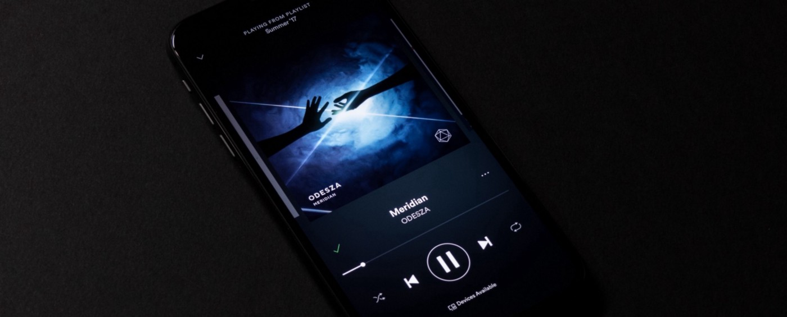
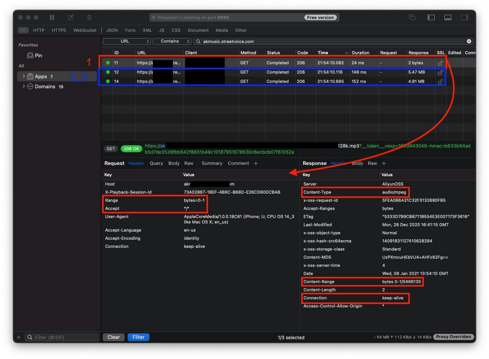
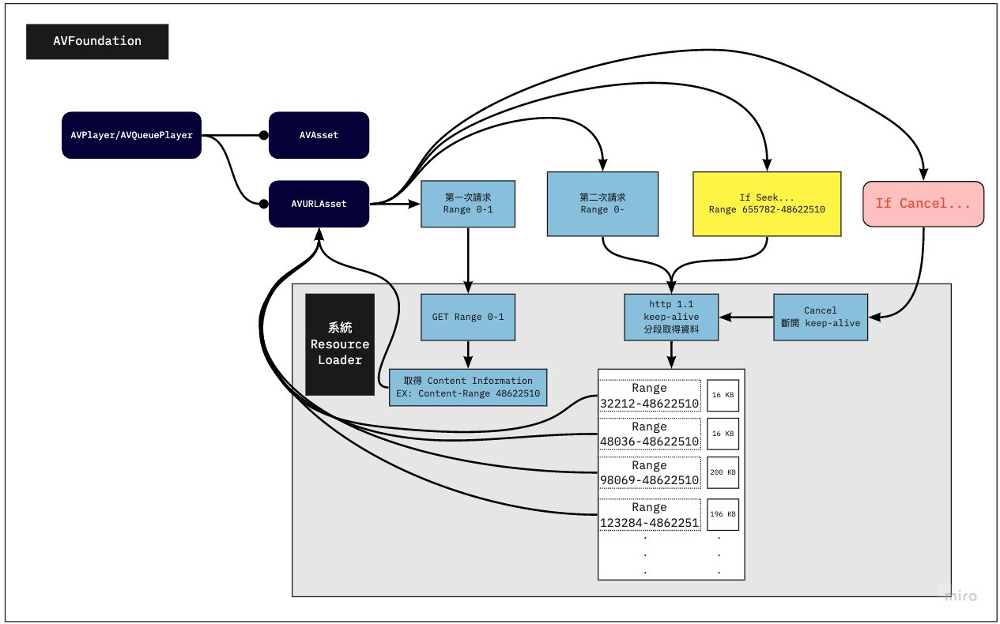
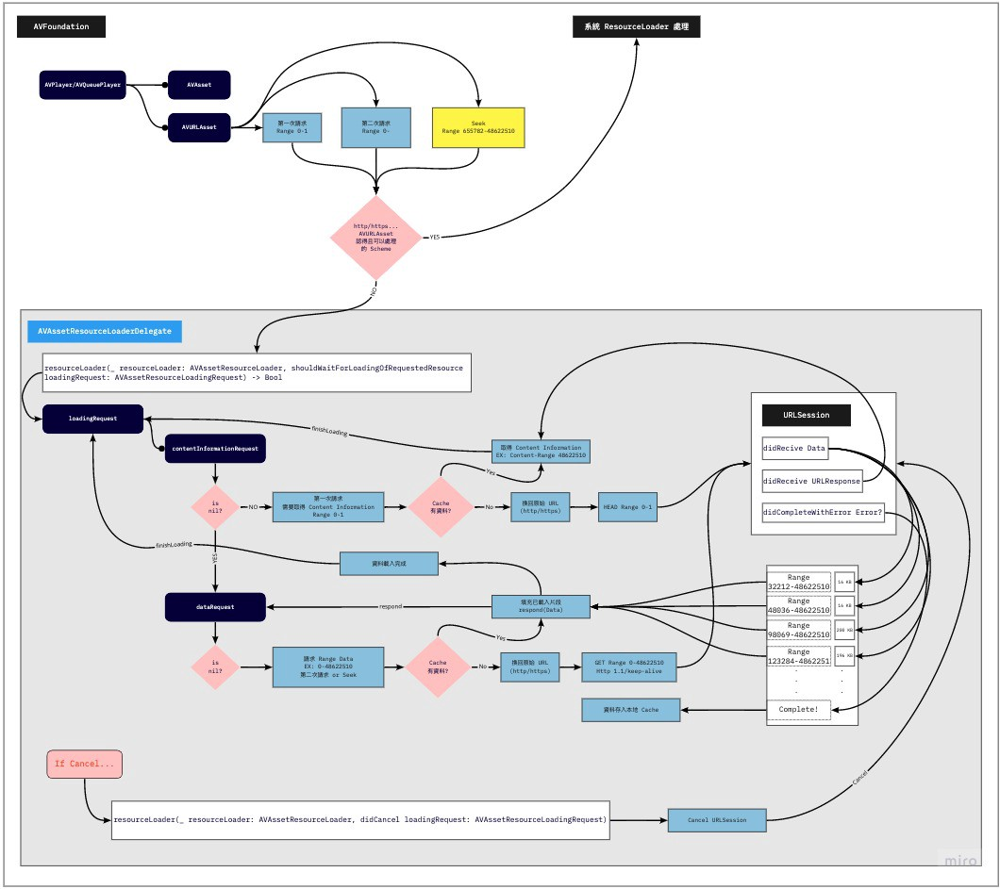
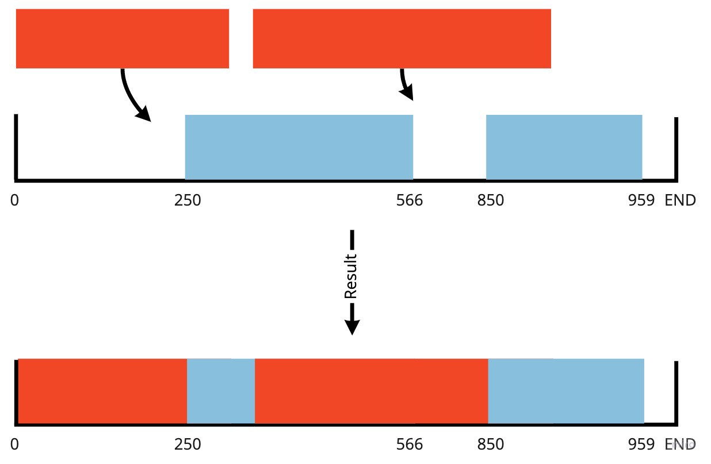
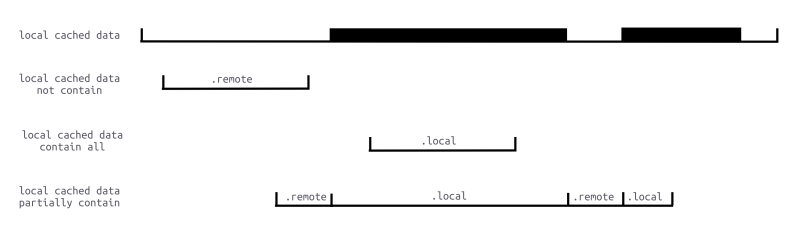
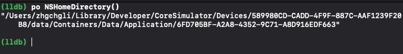
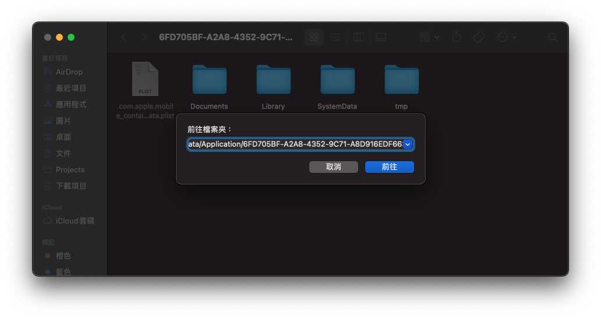
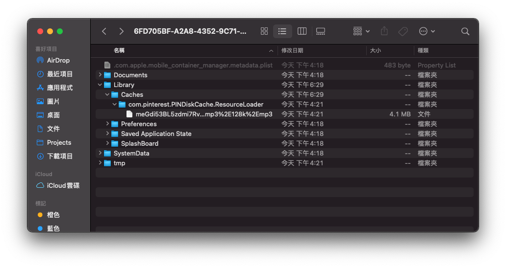
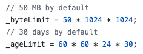

### AVPlayer 實踐本地 Cache 功能大全

AVPlayer/AVQueuePlayer with AVURLAsset 實作 AVAssetResourceLoaderDelegate




Photo by [Tyler Lastovich](https://unsplash.com/@lastly?utm_source=unsplash&utm_medium=referral&utm_content=creditCopyText)
### 前言

既上一篇「 [iOS HLS Cache 實踐方法探究之旅](https://medium.com/zrealm-ios-dev/ios-hls-cache-%E5%AF%A6%E8%B8%90%E6%96%B9%E6%B3%95%E6%8E%A2%E7%A9%B6%E4%B9%8B%E6%97%85-d796bf8e661e) 」後已過了大半年，團隊還是一直想要實現邊播邊 Cache 功能因為對成本的影響極大；我們是音樂串流平台，如果每次播放同樣的歌曲都要重新拿整個檔案，對我們或對非吃到飽的使用者來說都很傷流量，雖然音樂檔案頂多幾 MB，但積沙成塔都是錢！

另外因為 Android 那邊已經有實作邊播邊 Cache 的功能了，之前有比較過花費，Android 端上線後明顯節省了許多流量；相對更多使用者的 iOS 應該能有更好的節流體現。

根據 [上一篇](https://medium.com/zrealm-ios-dev/ios-hls-cache-%E5%AF%A6%E8%B8%90%E6%96%B9%E6%B3%95%E6%8E%A2%E7%A9%B6%E4%B9%8B%E6%97%85-d796bf8e661e) 的經驗，如果我們要繼續使用 HLS (.m3u8/.ts) 來達成目的；事情將會變得非常複雜甚至無法達成；我們退而求其次退回去使用 mp3 檔，這樣就能直接使用 `AVAssetResourceLoaderDelegate` 進行實作。
### 目標
- 播放過的音樂會在本地產生 Cache 備份
- 播放音樂時先檢查本地有無 Cache 讀取，有則不再重伺服器要檔案
- 可設 Cache 策略；上限總容量，超過時開始刪除最舊的 Cache 檔案
- 不干涉原本 AVPlayer 播放機制
（不然最快的方法就是自己先用 URLSession 把 mp3 載下來塞給 AVPlayer，但這樣就失去原本能播到哪載到哪的功能，使用者需要等待更長時間＆更消耗流量）

### 前導知識 (1)— HTTP/1.1 Range 範圍請求、Connection Keep-Alive
#### HTTP/1.1 Range 範圍請求

首先我們要先了解在播放影片、音樂時是怎麼跟伺服器要求資料的；一般來說影片、音樂檔案都很大，不可能等到全部拿完才開始播放常見的是播到哪拿到了，只要有正在播放區段的資料就能運作。

要達到這個功能的方法就是透過 HTTP/1.1 Range 只返回指定資料字節範圍的資料，例如指定 0–100 就只返回 0–100 這 100 bytes 大小的資料；透過這個方法，可以依序分段取得資料，然後再彙整再一起成完整的檔案；這個方法也能運用在檔案下載續傳功能上。
#### 如何應用？

我們會先使用 HEAD 去看 Response Header 了解到伺服器是否支援 Range 範圍請求、資源總長度、檔案類型：
```
curl -i -X HEAD http://zhgchg.li/music.mp3
```

**使用 HEAD 我們能從 Response Header 得到以下資訊：**
- **Accept-Ranges: bytes** 代表伺服器支援 Range 範圍請求
如果沒有 Response 這個值或是是 Accept-Ranges: none 都代表不支援
- **Content-Length:** 資源總長度，我們要知道總長度才能去分段要資料。
- **Content-Type:** 檔案類型，AVPlayer 播放時需要知道的資訊。


但有時我們也會使用 GET `Range: bytes=0–1` ，意思是我要求 0–1 範圍的資料但實際我根本不 Care 0–1是什麼內容，我只是要看 Response Header 的資訊； **原生 AVPlayer 就是使用 GET 去看，所以本篇也照舊使用** 。
> _但比較建議使用 HEAD 去看，一方法比較正確，另一方面萬一伺服器不支援 Range 功能；用 GET 去摸就會變強迫下載完整檔案。_

```
curl -i -X GET http://zhgchg.li/music.mp3 -H "Range: bytes=0–1"
```

**使用 GET 我們能從 Response Header 得到以下資訊：**
- **Accept-Ranges: bytes** 代表伺服器支援 Range 範圍請求
如果沒有 Response 這個值或是是 Accept-Ranges: none 都代表不支援
- **Content-Range: bytes 0–1/資源總長度** ，「/」後的數字及資源總長度，我們要知道總長度才能去分段要資料。
- **Content-Type:** 檔案類型，AVPlayer 播放時需要知道的資訊。





**知道伺服器支援 Range 範圍請求後，就能分段發起範圍請求：**
```
curl -i -X GET http://zhgchg.li/music.mp3 -H "Range: bytes=0–100"
```

**伺服器會返回 206 Partial Content：**
```
Content-Range: bytes 0-100/總長度
Content-Length: 100
...
(binary content)
```

這時我們就得到 Range 0–100 的 Data，可再繼續發新請求拿 Range 100–200..200–300…到結束。

如果拿的 Range 超過資源總長度會返回 416 Range Not Satisfiable。

另外，想拿完整檔案資料除了可以請求 Range 0-總長度，也可以使用 0- 方式即可：
```
curl -i -X GET http://zhgchg.li/music.mp3 -H "Range: bytes=0–"
```

其他還可以同個請求要求多個 Range 資料及下條件式子，但我們用不到，詳情可 [參考這](https://developer.mozilla.org/zh-CN/docs/Web/HTTP/Range_requests) 。
#### Connection Keep-Alive

http 1.1 預設是開啟狀態， **此特性能實時取得已下載的資料** ，例如檔案 5 mb，能 16 kb、16 kb、16 kb… 的取得，不用等到 5mb 都好才給你。
```
Connection: Keey-Alive
```
#### **_如果發現伺服器不支援 Range、_** Keep-Alive **_？_**
> _那也不用搞這麼多了，直接自己用 URLSession 下載完 mp3 檔案塞給播放器就好….但這不是我們要的結果，可以請後端幫忙修改伺服器設定。_

### 前導知識 (2) — AVPlayer 原生是如何處理 AVURLAsset 資源？





當我們使用 AVURLAsset init with URL 資源並賦予給 AVPlayer/AVQueuePlayer 開始播放之後，同上所述，首先會用 GET Range 0–1 去取得是否支援 Range 範圍請求、資源總長度、檔案類型這三個資訊。

有了檔案資訊後，會再發起第二次請求，請求從 0-總長度 的資料。
> _⚠️ **AVPlayer 會請求從 0-總長度 的資料，並透過實時取得已下載的資料特性 (** 16 kb、16 kb、16 kb…) **取得到他覺得資料足夠後，會發起 Cancel 取消這個網路請求** （所以實際也不會拿完，除非檔案太小）。_ 
_繼續播放後才會透過 Range 往後請求資料。_ 
_（這部分跟我之前想的不一樣，我以為會是0–100、100–200..這樣請求）_


**AVPlayer 請求範例：**
```
1. GET Range 0-1 => Response: 總長度 150000 / public.mp3 / true
2. GET 0-150000...
3. 16 kb receive
4. 16 kb receive...
5. cancel() // current offset is 700
6. 繼續播放
7. GET 700-150000...
8. 16 kb receive
9. 16 kb receive...
10. cancel() // current offset is 1500
11. 繼續播放
12. GET 1500-150000...
13. 16 kb receive
14. 16 kb receive...
16. If seek to...5000
17. cancel(12.) // current offset is 2000
18. GET 5000-150000...
19. 16 kb receive
20. 16 kb receive...
...
```
> _⚠️ **iOS ≤12 的情況下，會先發幾個較短的請求試著摸摸看（？然後才會發要求到總長度的請求； iOS ≥ 13 則會直接發要求到總長度的請求。**_


還有個題外的坑，就是在觀察怎麼拿資源的時候，我使用了 [mitmproxy](https://medium.com/zrealm-ios-dev/app%E6%9C%89%E7%94%A8https%E5%82%B3%E8%BC%B8-%E4%BD%86%E8%B3%87%E6%96%99%E9%82%84%E6%98%AF%E8%A2%AB%E5%81%B7%E4%BA%86-46410aaada00) 工具嗅探，結果發現它顯示有錯，會等到 response 全部回來才會顯示，而不是顯示分段、使用持久連接接續下載；害我嚇了一大跳！以為 iOS 很笨居然每次都要整個檔案回來！下次要用工具時要有保持一點懷疑 Orz
#### Cancel 發起的時機
1. 前面說到的第二次請求，請求從 0 開始 到總長度的資源，有足夠 Data 後會發起 Cancel 取消請求。
2. Seek 時會先發起 Cancel 取消先前的請求。

> _⚠️ 在 AVQueuePlayer 中切換到下一個資源、AVPlayer 更換播放資源時並不會發起 Cancel 取消前一首的請求。_

#### AVQueue Pre-buffering

其實也是同樣呼叫 Resource Loader 處理，只是他要求的資料範圍會比較小。
### 實現

有了以上前導知識後我們來看實現 AVPlayer 本地 Cache 功能的原理方式。

就是之前有提到的 `AVAssetResourceLoaderDelegate` ，這個接口讓我們能 **自行實踐 Resource Loader** 給 Asset 用。

Resource Loader 實際就是個打工仔，播放器是要檔案資訊還是檔案資料，範圍哪裡都哪裡都是他告訴我們，我們去做就是。
> _看到有範例是一個 **Resource Loader 服務所有 AVURLAsset** ，我覺得是錯的，應該要一個 Resource Loader 服務一個 AVURLAsset，跟著 AVURLAsset 的生命週期，他本來就屬於 AVURLAsset。_
> _一個 Resource Loader 服務所有 AVURLAsset 在 AVQueuePlayer 上會變得非常複雜且難以管理。_

#### 進入自訂的 Resource Loader 的時機點

要注意的是不是實踐了自己的 Resource Loader 他就會理你，只有當系統無法辨識處理這個資源的時候，才會走你的 Resource Loader。

所以我們在將 URL 資源給予 AVURLAsset 之前要先將 Scheme 換成我們自訂的 Scheme，不能是 http/https… 這些系統能處理的 Scheme。
```
http://zhgchg.li/music.mp3 => cacheable://zhgchg.li/music.mp3
```
#### **`AVAssetResourceLoaderDelegate`**

**只有兩個方法需要實現：**
- func resourceLoader(_ resourceLoader: AVAssetResourceLoader, shouldWaitForLoadingOfRequestedResource **loadingRequest** : AVAssetResourceLoadingRequest) -> Bool :


此方法問我們能不能處理此資源，return true 能，return false 我們也不處理（unsupported url）。

我們能從 `loadingRequest` 取出要請求什麼（第一次請求檔案資訊還是請求資料，請求資料的話 Range 是多少到多少）；知道請求後我們自行發起請求去拿資料， **在這我們就能決定要發起 URLSession 還是從本地返回 Data** 。

另外也能在此做 Data 加解密操作，保護原始資料。
- func resourceLoader(_ resourceLoader: AVAssetResourceLoader, didCancel **loadingRequest** : AVAssetResourceLoadingRequest) :


前述說到的 **Cancel 發起時機** 發起 Cancel 時…

我們可以在這去取消正在請求的 URLSession。




#### 本地 Cache 實現方式

Cache 的部分我直接使用 [PINCache](https://github.com/pinterest/PINCache) ，將 Cache 工作交由他處理，免去我們要處理 Cache 讀寫 DeadLock、清除 Cache LRU 策略 實作上的問題。
> **_️️⚠️️️️️️️️️️️OOM警告！_** 
_因為這邊是針對音樂做 Cache 檔案大小頂多 10 MB 上下，所以才能使用 PINCache 作為本地 Cache 工具；如果是要服務影片就無法使用此方法（可能一次要載入好幾 GB 的資料到記憶體）_


■■■■■■■■■■■■■■ 
> **[Lex Tang](https://twitter.com/lexrus) @ Twitter Says:** 

> > @[zhgchgli](https://twitter.com/zhgchgli) 传统保守做法就是用 FileHandle，我写了大约 200 行 Swift 搞定这个事，它的 seek 和 read/write 能有效避免读写时的 OOM。之后 responds data request 的逻辑，可以参考 LeetCode 上 segment tree 相关的问题，如 [leetcode.com/problems/range…](https://leetcode.com/problems/range-module/) 

> **Tweeted at [2021-01-06 14:35:13](https://twitter.com/lexrus/status/1346827668860256258).** 

■■■■■■■■■■■■■■ 


有這部分需求可參考大大的做法，用 FileHandle seek read/write 的特性進行處理。
### 開工！

不囉唆，先上完整專案：


[](https://github.com/zhgchgli0718/resourceLoaderDemo)

#### AssetData

本地 Cache 資料物件映射實現 NSCoding，因 PINCache 是依賴 archivedData 方法 encode/decode。
```swift
import Foundation
import CryptoKit

class AssetDataContentInformation: NSObject, NSCoding {
    @objc var contentLength: Int64 = 0
    @objc var contentType: String = ""
    @objc var isByteRangeAccessSupported: Bool = false
    
    func encode(with coder: NSCoder) {
        coder.encode(self.contentLength, forKey: #keyPath(AssetDataContentInformation.contentLength))
        coder.encode(self.contentType, forKey: #keyPath(AssetDataContentInformation.contentType))
        coder.encode(self.isByteRangeAccessSupported, forKey: #keyPath(AssetDataContentInformation.isByteRangeAccessSupported))
    }
    
    override init() {
        super.init()
    }
    
    required init?(coder: NSCoder) {
        super.init()
        self.contentLength = coder.decodeInt64(forKey: #keyPath(AssetDataContentInformation.contentLength))
        self.contentType = coder.decodeObject(forKey: #keyPath(AssetDataContentInformation.contentType)) as? String ?? ""
        self.isByteRangeAccessSupported = coder.decodeObject(forKey: #keyPath(AssetDataContentInformation.isByteRangeAccessSupported)) as? Bool ?? false
    }
}

class AssetData: NSObject, NSCoding {
    @objc var contentInformation: AssetDataContentInformation = AssetDataContentInformation()
    @objc var mediaData: Data = Data()
    
    override init() {
        super.init()
    }

    func encode(with coder: NSCoder) {
        coder.encode(self.contentInformation, forKey: #keyPath(AssetData.contentInformation))
        coder.encode(self.mediaData, forKey: #keyPath(AssetData.mediaData))
    }
    
    required init?(coder: NSCoder) {
        super.init()
        self.contentInformation = coder.decodeObject(forKey: #keyPath(AssetData.contentInformation)) as? AssetDataContentInformation ?? AssetDataContentInformation()
        self.mediaData = coder.decodeObject(forKey: #keyPath(AssetData.mediaData)) as? Data ?? Data()
    }
}
```

`AssetData` **存放：**
- `contentInformation` : AssetDataContentInformation
`AssetDataContentInformation` ：
存放 是否支援 Range 範圍請求(isByteRangeAccessSupported)、資源總長度(contentLength)、檔案類型(contentType)
- `mediaData` : 原始音訊 Data **（這邊檔案太大會 OOM）**


■■■■■■■■■■■■■■ 
> **[Lex Tang](https://twitter.com/lexrus) @ Twitter Says:** 

> > @[zhgchgli](https://twitter.com/zhgchgli) AssetData.mediaData 如果取的是一个 5GB 的 4K HDR 视频，还是会 OOM吧？另外谨慎一点的话，应该先判断 Accept-Ranges 再去取 Content-Range。 

> **Tweeted at [2021-01-31 15:06:09](https://twitter.com/lexrus/status/1355895147381198852?s=20).** 

■■■■■■■■■■■■■■ 

#### PINCacheAssetDataManager

封裝 Data 存入、取出 PINCache 邏輯。
```swift
import PINCache
import Foundation

protocol AssetDataManager: NSObject {
    func retrieveAssetData() -> AssetData?
    func saveContentInformation(_ contentInformation: AssetDataContentInformation)
    func saveDownloadedData(_ data: Data, offset: Int)
    func mergeDownloadedDataIfIsContinuted(from: Data, with: Data, offset: Int) -> Data?
}

extension AssetDataManager {
    func mergeDownloadedDataIfIsContinuted(from: Data, with: Data, offset: Int) -> Data? {
        if offset <= from.count && (offset + with.count) > from.count {
            let start = from.count - offset
            var data = from
            data.append(with.subdata(in: start..<with.count))
            return data
        }
        return nil
    }
}

//

class PINCacheAssetDataManager: NSObject, AssetDataManager {
    
    static let Cache: PINCache = PINCache(name: "ResourceLoader")
    let cacheKey: String
    
    init(cacheKey: String) {
        self.cacheKey = cacheKey
        super.init()
    }
    
    func saveContentInformation(_ contentInformation: AssetDataContentInformation) {
        let assetData = AssetData()
        assetData.contentInformation = contentInformation
        PINCacheAssetDataManager.Cache.setObjectAsync(assetData, forKey: cacheKey, completion: nil)
    }
    
    func saveDownloadedData(_ data: Data, offset: Int) {
        guard let assetData = self.retrieveAssetData() else {
            return
        }
        
        if let mediaData = self.mergeDownloadedDataIfIsContinuted(from: assetData.mediaData, with: data, offset: offset) {
            assetData.mediaData = mediaData
            
            PINCacheAssetDataManager.Cache.setObjectAsync(assetData, forKey: cacheKey, completion: nil)
        }
    }
    
    func retrieveAssetData() -> AssetData? {
        guard let assetData = PINCacheAssetDataManager.Cache.object(forKey: cacheKey) as? AssetData else {
            return nil
        }
        return assetData
    }
}
```

這邊多抽出 Protocol 因為未來可能使用其他儲存方式替代 PINCache，所以其他程式在使用時是依賴 Protocol 而非 Class 實體。
> _⚠️ `mergeDownloadedDataIfIsContinuted` **這個方法極其重要。**_


照線性播放只要一直 append 新 Data 到 Cache Data 中即可，但現實情況複雜得多，使用者可能播了 Range 0~100，直接 Seek 到 Range 200–500 播放；如何將已有的 0-100 Data 與新的 200–500 Data 合併就是一個很大的問題。
> _⚠️Data 合併有問題會出現可怕的播放鬼畜問題…._


這邊的答案是， **我們不處理非連續資料** ；因為敝專案僅為音訊，檔案也就幾 MB (≤ 10MB) 以考量開發成本就沒做了，我只處理合併連續的資料（例如目前已有 0~100，新資料是 75~200，合併之後變0~200；如果新資料是 150~200，我則會忽略不合併處理）





如果要考慮非連續合併，除了在儲存上要使用其他方法（要有辦法辨識空缺部分）；在 Request 時也要能 Query 出哪段需要發網路請求去拿、哪段是從本地拿；要考量到這情況實作會非常複雜。




圖片取自： [iOS AVPlayer 视频缓存的设计与实现](http://chuquan.me/2019/12/03/ios-avplayer-support-cache/)
#### CachingAVURLAsset

AVURLAsset 是 weak 持有 ResourceLoader Delegate，所以這邊建議自己建立一個 AVURLAsset Class 繼承自 AVURLAsset，在內部建立、賦予、持有 ResourceLoader ，讓他跟著 AVURLAsset 的生命週期；另外也可以儲存原始 URL、CacheKey 等資訊…。
```swift
class CachingAVURLAsset: AVURLAsset {
    static let customScheme = "cacheable"
    let originalURL: URL
    private var _resourceLoader: ResourceLoader?
    
    var cacheKey: String {
        return self.url.lastPathComponent
    }
    
    static func isSchemeSupport(_ url: URL) -> Bool {
        guard let components = URLComponents(url: url, resolvingAgainstBaseURL: false) else {
            return false
        }
        
        return ["http", "https"].contains(components.scheme)
    }
    
    override init(url URL: URL, options: [String: Any]? = nil) {
        self.originalURL = URL
        
        guard var components = URLComponents(url: URL, resolvingAgainstBaseURL: false) else {
            super.init(url: URL, options: options)
            return
        }
        
        components.scheme = CachingAVURLAsset.customScheme
        guard let url = components.url else {
            super.init(url: URL, options: options)
            return
        }
        
        super.init(url: url, options: options)
        
        let resourceLoader = ResourceLoader(asset: self)
        self.resourceLoader.setDelegate(resourceLoader, queue: resourceLoader.loaderQueue)
        self._resourceLoader = resourceLoader
    }
}
```

**使用：**
```swift
if CachingAVURLAsset.isSchemeSupport(url) {
  let asset = CachingAVURLAsset(url: url)
  let avplayer = AVPlayer(asset)
  avplayer.play()
}
```

其中 `isSchemeSupport()` 是用來判斷 URL 是否支援掛我們的 Resource Loader（排除 file:// ）。

`originalURL` 存放原始資源 URL。

`cacheKey` 存放這個資源的 Cache Key，這邊直接用檔案名稱當 Cache Key。

`cacheKey` 請依照現實場景做調整，如果檔案名稱未 hash 可能重複就建議先 hash 後當 key 避免碰撞；如果要 hash 整個 URL 當 key 也要注意 URL 是否會變動 (例如有用 CDN)。

Hash 可使用 md5…sha..，iOS ≥ 13 可直接使用 Apple 的 [CryptoKit](https://developer.apple.com/documentation/cryptokit/) ，其他就上 Github 找吧！
#### ResourceLoaderRequest
```swift
import Foundation
import CoreServices

protocol ResourceLoaderRequestDelegate: AnyObject {
    func dataRequestDidReceive(_ resourceLoaderRequest: ResourceLoaderRequest, _ data: Data)
    func dataRequestDidComplete(_ resourceLoaderRequest: ResourceLoaderRequest, _ error: Error?, _ downloadedData: Data)
    func contentInformationDidComplete(_ resourceLoaderRequest: ResourceLoaderRequest, _ result: Result<AssetDataContentInformation, Error>)
}

class ResourceLoaderRequest: NSObject, URLSessionDataDelegate {
    struct RequestRange {
        var start: Int64
        var end: RequestRangeEnd
        
        enum RequestRangeEnd {
            case requestTo(Int64)
            case requestToEnd
        }
    }
    
    enum RequestType {
        case contentInformation
        case dataRequest
    }
    
    struct ResponseUnExpectedError: Error { }
    
    private let loaderQueue: DispatchQueue
    
    let originalURL: URL
    let type: RequestType
    
    private var session: URLSession?
    private var dataTask: URLSessionDataTask?
    private var assetDataManager: AssetDataManager?
    
    private(set) var requestRange: RequestRange?
    private(set) var response: URLResponse?
    private(set) var downloadedData: Data = Data()
    
    private(set) var isCancelled: Bool = false {
        didSet {
            if isCancelled {
                self.dataTask?.cancel()
                self.session?.invalidateAndCancel()
            }
        }
    }
    private(set) var isFinished: Bool = false {
        didSet {
            if isFinished {
                self.session?.finishTasksAndInvalidate()
            }
        }
    }
    
    weak var delegate: ResourceLoaderRequestDelegate?
    
    init(originalURL: URL, type: RequestType, loaderQueue: DispatchQueue, assetDataManager: AssetDataManager?) {
        self.originalURL = originalURL
        self.type = type
        self.loaderQueue = loaderQueue
        self.assetDataManager = assetDataManager
        super.init()
    }
    
    func start(requestRange: RequestRange) {
        guard isCancelled == false, isFinished == false else {
            return
        }
        
        self.loaderQueue.async { [weak self] in
            guard let self = self else {
                return
            }
            
            var request = URLRequest(url: self.originalURL)
            self.requestRange = requestRange
            let start = String(requestRange.start)
            let end: String
            switch requestRange.end {
            case .requestTo(let rangeEnd):
                end = String(rangeEnd)
            case .requestToEnd:
                end = ""
            }
            
            let rangeHeader = "bytes=\(start)-\(end)"
            request.setValue(rangeHeader, forHTTPHeaderField: "Range")
            
            let session = URLSession(configuration: .default, delegate: self, delegateQueue: nil)
            self.session = session
            let dataTask = session.dataTask(with: request)
            self.dataTask = dataTask
            dataTask.resume()
        }
    }
    
    func cancel() {
        self.isCancelled = true
    }
    
    func urlSession(_ session: URLSession, dataTask: URLSessionDataTask, didReceive data: Data) {
        guard self.type == .dataRequest else {
            return
        }
        
        self.loaderQueue.async {
            self.delegate?.dataRequestDidReceive(self, data)
            self.downloadedData.append(data)
        }
    }
    
    func urlSession(_ session: URLSession, dataTask: URLSessionDataTask, didReceive response: URLResponse, completionHandler: @escaping (URLSession.ResponseDisposition) -> Void) {
        self.response = response
        completionHandler(.allow)
    }
    
    func urlSession(_ session: URLSession, task: URLSessionTask, didCompleteWithError error: Error?) {
        self.isFinished = true
        self.loaderQueue.async {
            if self.type == .contentInformation {
                guard error == nil,
                      let response = self.response as? HTTPURLResponse else {
                    let responseError = error ?? ResponseUnExpectedError()
                    self.delegate?.contentInformationDidComplete(self, .failure(responseError))
                    return
                }
                
                let contentInformation = AssetDataContentInformation()
                
                if let rangeString = response.allHeaderFields["Content-Range"] as? String,
                   let bytesString = rangeString.split(separator: "/").map({String($0)}).last,
                   let bytes = Int64(bytesString) {
                    contentInformation.contentLength = bytes
                }
                
                if let mimeType = response.mimeType,
                   let contentType = UTTypeCreatePreferredIdentifierForTag(kUTTagClassMIMEType, mimeType as CFString, nil)?.takeRetainedValue() {
                    contentInformation.contentType = contentType as String
                }
                
                if let value = response.allHeaderFields["Accept-Ranges"] as? String,
                   value == "bytes" {
                    contentInformation.isByteRangeAccessSupported = true
                } else {
                    contentInformation.isByteRangeAccessSupported = false
                }
                
                self.assetDataManager?.saveContentInformation(contentInformation)
                self.delegate?.contentInformationDidComplete(self, .success(contentInformation))
            } else {
                if let offset = self.requestRange?.start, self.downloadedData.count > 0 {
                    self.assetDataManager?.saveDownloadedData(self.downloadedData, offset: Int(offset))
                }
                self.delegate?.dataRequestDidComplete(self, error, self.downloadedData)
            }
        }
    }
}
```

針對 Remote Request 的封裝，主要是服務 ResourceLoader 發起的資料請求。

`RequestType` ：用來區分此 Request 是 第一次請求檔案資訊(contentInformation)、還是請求資料(dataRequest)

`RequestRange` ：請求 Range 範圍，end 可指定到哪(requestTo(Int64))或全部(requestToEnd)。

檔案資訊可由：
```
urlSession(_ session: URLSession, dataTask: URLSessionDataTask, didReceive response: URLResponse, completionHandler: @escaping (URLSession.ResponseDisposition) -> Void)
```

中取得 Response Header，另外要注意如果要改 HEAD 去摸，不會進這個要用其他方法接。
- `isByteRangeAccessSupported` ：看 Response Header 中的 **Accept-Ranges == bytes**
- `contentType` ：播放器要的檔案類型資訊，格式是統一類識別符，不是 audio/mpeg ，而是寫作 public.mp3
- `contentLength` ：看 Response Header 中的 **Content-Range** ：bytes 0–1/ **資源總長度**

> _⚠️這邊要注意伺服器給的格式大小寫，不一定是寫作 Accept-Ranges/Content-Range；有的伺服器的格式是小寫 accept-ranges、Accept-ranges…_


**補充：如果要考量大小寫可以寫 HTTPURLResponse Extension**
```swift
import CoreServices

extension HTTPURLResponse {
    func parseContentLengthFromContentRange() -> Int64? {
        let contentRangeKeys: [String] = [
            "Content-Range",
            "content-range",
            "Content-range",
            "content-Range"
        ]
        
        var rangeString: String?
        for key in contentRangeKeys {
            if let value = self.allHeaderFields[key] as? String {
                rangeString = value
                break
            }
        }
        
        guard let rangeString = rangeString,
              let contentLengthString = rangeString.split(separator: "/").map({String($0)}).last,
              let contentLength = Int64(contentLengthString) else {
            return nil
        }
        
        return contentLength
    }
    
    func parseAcceptRanges() -> Bool? {
        let contentRangeKeys: [String] = [
            "Accept-Ranges",
            "accept-ranges",
            "Accept-ranges",
            "accept-Ranges"
        ]
        
        var rangeString: String?
        for key in contentRangeKeys {
            if let value = self.allHeaderFields[key] as? String {
                rangeString = value
                break
            }
        }
        
        guard let rangeString = rangeString else {
            return nil
        }
        
        return rangeString == "bytes" || rangeString == "Bytes"
    }
    
    func mimeTypeUTI() -> String? {
        guard let mimeType = self.mimeType,
           let contentType = UTTypeCreatePreferredIdentifierForTag(kUTTagClassMIMEType, mimeType as CFString, nil)?.takeRetainedValue() else {
            return nil
        }
        
        return contentType as String
    }
}
```

使用：
- contentLength = response.parseContentLengthFromContentRange()
- isByteRangeAccessSupported = response.parseAcceptRanges()
- contentType = response.mimeTypeUTI()

```
urlSession(_ session: URLSession, dataTask: URLSessionDataTask, didReceive data: Data)
```

同前導知識所述，會實時取得已下載的資料，所以這個方法會一直進，片段片段的拿到 Data；我們將他 append 進 `downloadedData` 存放。
```
urlSession(_ session: URLSession, task: URLSessionTask, didCompleteWithError error: Error?)
```

任務取消或結束時都會進這個方法，在這將已下載的資料保存下來。

如前導知識中提到的 Cancel 機制，因播放器在拿到足夠資料後就會發起 Cancel，Cancel Request；所以進到這個方法時實際會是 `error = NSURLErrorCancelled` ，因此不管 error 我們有拿到資料都會嘗試存下來。
> _⚠️ 因 URLSession 會用並行方式出去請求資料，所以請保持操作都在DispatchQueue裡，避免資料錯亂(資料錯亂一樣會出現可怕的播放鬼畜)。_
> _️️⚠️URLSession 沒有呼叫 `finishTasksAndInvalidate` 或 `invalidateAndCancel` 兩個方法都會強持有物件導致 Memory Leak；所以不管是取消或是完成我們都要呼叫，這樣才能在任務結束釋放 Request。_
> _️️⚠️️️️️️️️️️️如果怕 `downloadedData` OOM，可以在 didReceive Data 中就存入本地。_

#### ResourceLoader
```swift
import AVFoundation
import Foundation

class ResourceLoader: NSObject {
    
    let loaderQueue = DispatchQueue(label: "li.zhgchg.resourceLoader.queue")
    
    private var requests: [AVAssetResourceLoadingRequest: ResourceLoaderRequest] = [:]
    private let cacheKey: String
    private let originalURL: URL
    
    init(asset: CachingAVURLAsset) {
        self.cacheKey = asset.cacheKey
        self.originalURL = asset.originalURL
        super.init()
    }

    deinit {
        self.requests.forEach { (request) in
            request.value.cancel()
        }
    }
}

extension ResourceLoader: AVAssetResourceLoaderDelegate {
    func resourceLoader(_ resourceLoader: AVAssetResourceLoader, shouldWaitForLoadingOfRequestedResource loadingRequest: AVAssetResourceLoadingRequest) -> Bool {
        
        let type = ResourceLoader.resourceLoaderRequestType(loadingRequest)
        let assetDataManager = PINCacheAssetDataManager(cacheKey: self.cacheKey)

        if let assetData = assetDataManager.retrieveAssetData() {
            if type == .contentInformation {
                loadingRequest.contentInformationRequest?.contentLength = assetData.contentInformation.contentLength
                loadingRequest.contentInformationRequest?.contentType = assetData.contentInformation.contentType
                loadingRequest.contentInformationRequest?.isByteRangeAccessSupported = assetData.contentInformation.isByteRangeAccessSupported
                loadingRequest.finishLoading()
                return true
            } else {
                let range = ResourceLoader.resourceLoaderRequestRange(type, loadingRequest)
                if assetData.mediaData.count > 0 {
                    let end: Int64
                    switch range.end {
                    case .requestTo(let rangeEnd):
                        end = rangeEnd
                    case .requestToEnd:
                        end = assetData.contentInformation.contentLength
                    }
                    
                    if assetData.mediaData.count >= end {
                        let subData = assetData.mediaData.subdata(in: Int(range.start)..<Int(end))
                        loadingRequest.dataRequest?.respond(with: subData)
                        loadingRequest.finishLoading()
                       return true
                    } else if range.start <= assetData.mediaData.count {
                        // has cache data...but not enough
                        let subEnd = (assetData.mediaData.count > end) ? Int((end)) : (assetData.mediaData.count)
                        let subData = assetData.mediaData.subdata(in: Int(range.start)..<subEnd)
                        loadingRequest.dataRequest?.respond(with: subData)
                    }
                }
            }
        }
        
        let range = ResourceLoader.resourceLoaderRequestRange(type, loadingRequest)
        let resourceLoaderRequest = ResourceLoaderRequest(originalURL: self.originalURL, type: type, loaderQueue: self.loaderQueue, assetDataManager: assetDataManager)
        resourceLoaderRequest.delegate = self
        self.requests[loadingRequest]?.cancel()
        self.requests[loadingRequest] = resourceLoaderRequest
        resourceLoaderRequest.start(requestRange: range)
        
        return true
    }
    
    func resourceLoader(_ resourceLoader: AVAssetResourceLoader, didCancel loadingRequest: AVAssetResourceLoadingRequest) {
        guard let resourceLoaderRequest = self.requests[loadingRequest] else {
            return
        }
        
        resourceLoaderRequest.cancel()
        requests.removeValue(forKey: loadingRequest)
    }
}

extension ResourceLoader: ResourceLoaderRequestDelegate {
    func contentInformationDidComplete(_ resourceLoaderRequest: ResourceLoaderRequest, _ result: Result<AssetDataContentInformation, Error>) {
        guard let loadingRequest = self.requests.first(where: { $0.value == resourceLoaderRequest })?.key else {
            return
        }
        
        switch result {
        case .success(let contentInformation):
            loadingRequest.contentInformationRequest?.contentType = contentInformation.contentType
            loadingRequest.contentInformationRequest?.contentLength = contentInformation.contentLength
            loadingRequest.contentInformationRequest?.isByteRangeAccessSupported = contentInformation.isByteRangeAccessSupported
            loadingRequest.finishLoading()
        case .failure(let error):
            loadingRequest.finishLoading(with: error)
        }
    }
    
    func dataRequestDidReceive(_ resourceLoaderRequest: ResourceLoaderRequest, _ data: Data) {
        guard let loadingRequest = self.requests.first(where: { $0.value == resourceLoaderRequest })?.key else {
            return
        }
        
        loadingRequest.dataRequest?.respond(with: data)
    }
    
    func dataRequestDidComplete(_ resourceLoaderRequest: ResourceLoaderRequest, _ error: Error?, _ downloadedData: Data) {
        guard let loadingRequest = self.requests.first(where: { $0.value == resourceLoaderRequest })?.key else {
            return
        }
        
        loadingRequest.finishLoading(with: error)
        requests.removeValue(forKey: loadingRequest)
    }
}

extension ResourceLoader {
    static func resourceLoaderRequestType(_ loadingRequest: AVAssetResourceLoadingRequest) -> ResourceLoaderRequest.RequestType {
        if let _ = loadingRequest.contentInformationRequest {
            return .contentInformation
        } else {
            return .dataRequest
        }
    }
    
    static func resourceLoaderRequestRange(_ type: ResourceLoaderRequest.RequestType, _ loadingRequest: AVAssetResourceLoadingRequest) -> ResourceLoaderRequest.RequestRange {
        if type == .contentInformation {
            return ResourceLoaderRequest.RequestRange(start: 0, end: .requestTo(1))
        } else {
            if loadingRequest.dataRequest?.requestsAllDataToEndOfResource == true {
                let lowerBound = loadingRequest.dataRequest?.currentOffset ?? 0
                return ResourceLoaderRequest.RequestRange(start: lowerBound, end: .requestToEnd)
            } else {
                let lowerBound = loadingRequest.dataRequest?.currentOffset ?? 0
                let length = Int64(loadingRequest.dataRequest?.requestedLength ?? 1)
                let upperBound = lowerBound + length
                return ResourceLoaderRequest.RequestRange(start: lowerBound, end: .requestTo(upperBound))
            }
        }
    }
}
```

`loadingRequest.contentInformationRequest` != nil 則代表是第一次請求，播放器要求先給檔案資訊。

請求檔案資訊時我們需要賦予這三項資訊：
- `loadingRequest.contentInformationRequest?.isByteRangeAccessSupported` ：是否支援 Range 拿 Data
- `loadingRequest.contentInformationRequest?.contentType` ：統一類識別符
- `loadingRequest.contentInformationRequest?.contentLength` ：檔案總長度 Int64


`loadingRequest.dataRequest?.requestedOffset` 可取得要求 Range 的起始 offset。

`loadingRequest.dataRequest?.requestedLength` 可取得要求 Range 的長度。

`loadingRequest.dataRequest?.requestsAllDataToEndOfResource` == true 則不管要求 Range 的長度，直接拿到底。

`loadingRequest.dataRequest?.respond(with: Data)` 返回已載入的 Data 給播放器。

`loadingRequest.dataRequest?.currentOffset` 可取得當前 data offset， `dataRequest?.respond(with: Data)` 後 `currentOffset` 會跟著推移。

`loadingRequest.finishLoading()` 資料都載完了，告知播放器。
```
resourceLoader(_ resourceLoader: AVAssetResourceLoader, shouldWaitForLoadingOfRequestedResource loadingRequest: AVAssetResourceLoadingRequest) -> Bool
```

播放器請求資料，我們先看本地 Cache 有無資料，有則返回；若只有部分資料則一樣返回部分，例如我本地有 0–100 ，播放器要求 0–200，則先返回 0–100。

若沒有本地 Cache、返回的資料不夠，則會發起 ResourceLoaderRequest 請求從網路拿資料。
```
resourceLoader(_ resourceLoader: AVAssetResourceLoader, didCancel loadingRequest: AVAssetResourceLoadingRequest)
```

播放器取消請求，取消 ResourceLoaderRequest。
> _你可能有發現_ `resourceLoaderRequestRange` _的 offset 是看 `currentOffset` ，因為我們會先從本地 `dataRequest?.respond(with: Data)` 已下載 Data；所以直接看推移後的 offset 即可。_

```
private var requests: [AVAssetResourceLoadingRequest: ResourceLoaderRequest] = [:]
```
> _⚠️ requests 有的範例是只用 `currentRequest: ResourceLoaderRequest` 來存放，這會有個問題，因為可能當前的 request 正在拿取，使用者又 seek 這時會取消舊的發起新的；但因不一定會照順序發生，可能先走發新請求再走取消；所以用 Dictionary 去存取操作還是比較安全！_
> _⚠️讓所有操作都在同個 DispatchQueue 防止出現資料鬼畜。_


**deinit 時取消所有還在請求的 requests** 
Resource Loader Deinit 即代表 AVURLAsset Deinit，代表播放器已經不需要這個資源了；所以我們可以 Cancel 還在取資料的 Request，已經載的一樣會寫入 Cache。
### 補充及鳴謝

感謝 [Lex 汤](https://medium.com/u/2d01a2439753) 大大指點。

感謝 [外孫女](https://medium.com/u/aab116fd9d4d) 提供開發上的意見及支持。
#### 本篇只針對音樂小檔

影片大檔案可能會在 downloadedData、AssetData/PINCacheAssetDataManager 發生 Out Of Memory 問題。

同前述，如果要解決這個問題請使用 fileHandler seek read/wirte 去操作本地 Cache 讀取寫入（取代AssetData/PINCacheAssetDataManager）；或找看看 Github 有沒有大 data write/read to file 的專案可用。
#### AVQueuePlayer 切換播放項目時取消正在下載的項目

同前導知識中所述，在更換播放目標時是不會發起 Cancel 的；如果是 AVPlayer 會走 AVURLAsset Deinit 所以下載也會中斷；但 AVQueuePlayer 不會，因為都還在 Queue 裡，只是播放目標換到下一首而已。

這邊唯一做法就只能接收變換播放目標通知，然後在收到通知後取消上一手的 AVURLAsset loading。
```
asset.cancelLoading()
```
#### 音訊資料加解密

音訊加解密可在 ResourceLoaderRequest 中拿到 Data 進行、還有儲存時能在 AssetData 的 encode/decode 對存在本地的 Data進行加解密。

**CryptoKit SHA 使用範本：**
```swift
class AssetData: NSObject, NSCoding {
    static let encryptionKeyString = "encryptionKeyExzhgchgli"
    ...
    func encode(with coder: NSCoder) {
        coder.encode(self.contentInformation, forKey: #keyPath(AssetData.contentInformation))
        
        if #available(iOS 13.0, *),
           let encryptionData = try? ChaChaPoly.seal(self.mediaData, using: AssetData.encryptionKey).combined {
            coder.encode(encryptionData, forKey: #keyPath(AssetData.mediaData))
        } else {
          //
        }
    }
    
    required init?(coder: NSCoder) {
        super.init()
        ...
        if let mediaData = coder.decodeObject(forKey: #keyPath(AssetData.mediaData)) as? Data {
            if #available(iOS 13.0, *),
               let sealedBox = try? ChaChaPoly.SealedBox(combined: mediaData),
               let decryptedData = try? ChaChaPoly.open(sealedBox, using: AssetData.encryptionKey) {
                self.mediaData = decryptedData
            } else {
              //
            }
        } else {
            //
        }
    }
}
```
#### PINCache 相關操作

PINCache 包含 PINMemoryCache 和 PINDiskCache，PINCache 會幫我們處理從檔案讀到 Memory 或從 Memory 寫入檔案的事，我們只需要對 PINCache 進行操作。

在模擬器中查找 Cache 檔案位置：





使用 `NSHomeDirectory()` 取得模擬器檔案路徑





Finder -> 前往 -> 貼上路徑





在 Library -> Caches -> com.pinterest.PINDiskCache.ResourceLoader 就是我們建的 Resource Loader Cache 目錄。

`PINCache(name: “ResourceLoader”)` 其中的 name 就是目錄名稱。

也可以指定 rootPath ，目錄就可以改到 Documents 底下（不怕被系統清掉）。

**設定 PINCache 最大上限：**
```swift
 PINCacheAssetDataManager.Cache.diskCache.byteCount = 300 * 1024 * 1024 // max: 300mb
 PINCacheAssetDataManager.Cache.diskCache.byteLimit = 90 * 60 * 60 * 24 // 90 days
```




系統預設上限

設 0 的話就不會主動刪除檔案。
### 後記

原先太小看這個功能的困難度，以為三兩下就能處理好；結果吃盡苦頭，大概又多花了兩週處理資料儲存的問題，不過也就此徹底了解整個 Resource Loader 運作機制、 GCD 、Data。
### 參考資料

最後附上研究如何實作的參考資料
1. [iOS AVPlayer 视频缓存的设计与实现](http://chuquan.me/2019/12/03/ios-avplayer-support-cache/) 僅講原理
2. [基于AVPlayer实现音视频播放和缓存，支持视频画面的同步输出](https://caisanze.com/post/swift-avplayer/) [ [SZAVPlayer](https://github.com/eroscai/SZAVPlayer) ] 有附程式（很完整，但很複雜）
3. [CachingPlayerItem](https://github.com/neekeetab/CachingPlayerItem/blob/7d998b8561693cf51077f0891ed240e92bec415e/CachingPlayerItem.swift) （簡易實現，較好懂但不完整）
4. [可能是目前最好的 AVPlayer 音视频缓存方案 AVAssetResourceLoaderDelegate](https://www.jianshu.com/p/28157247d6a7)
5. [仿抖音 Swift 版](https://sshiqiao.github.io/document/douyin-swift.html#1) [ [Github](https://github.com/sshiqiao/douyin-ios-swift) ]（蠻有意思的專案，復刻抖音 APP；裡面也有用到 Resource Loader）
6. [iOS HLS Cache 實踐方法探究之旅](https://medium.com/zrealm-ios-dev/ios-hls-cache-%E5%AF%A6%E8%B8%90%E6%96%B9%E6%B3%95%E6%8E%A2%E7%A9%B6%E4%B9%8B%E6%97%85-d796bf8e661e)

### 延伸
- [DLCachePlayer](https://github.com/dminoror/DLCachePlayer) (Objective-C 版)


[](https://button.like.co/zhgchgli)


有任何問題及指教歡迎 [與我聯絡](https://www.zhgchg.li/contact) 。


_Converted [Medium Post](https://medium.com/zrealm-ios-dev/avplayer-%E5%AF%A6%E8%B8%90%E6%9C%AC%E5%9C%B0-cache-%E5%8A%9F%E8%83%BD%E5%A4%A7%E5%85%A8-6ce488898003) by [ZMediumToMarkdown](https://github.com/ZhgChgLi/ZMediumToMarkdown)._
