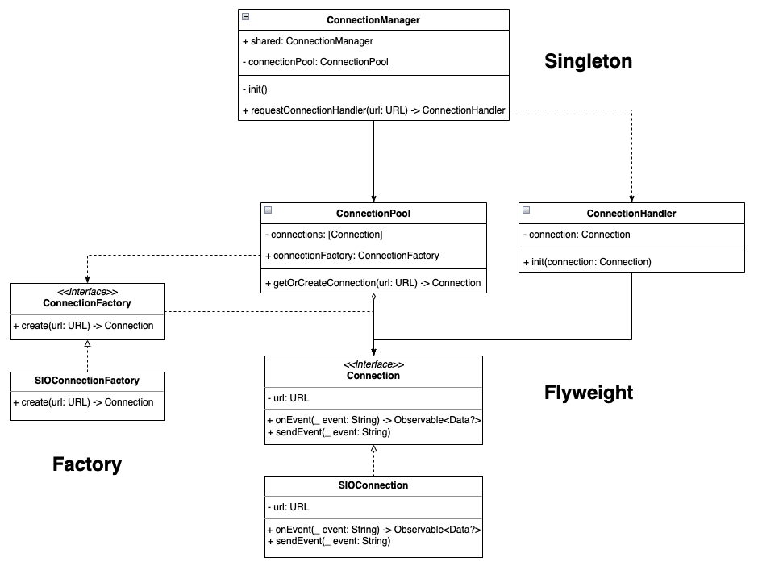
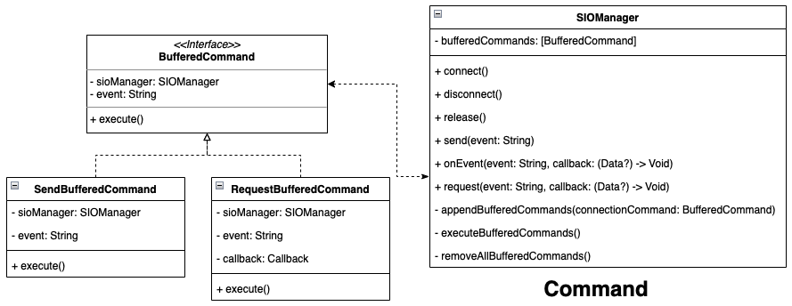
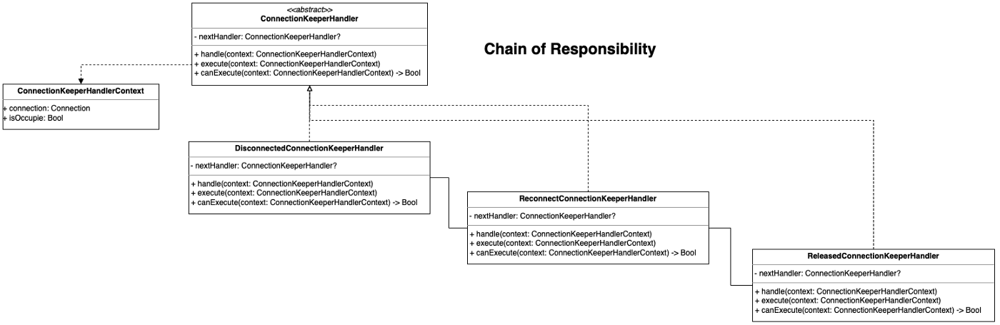
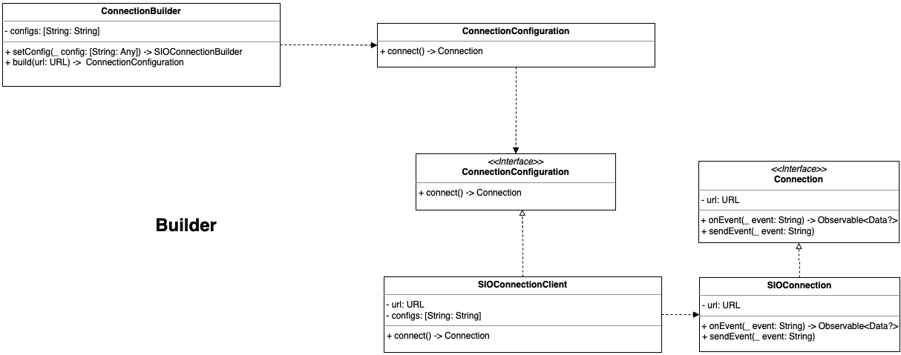

### Design Patterns 的實戰應用紀錄

封裝 Socket.IO Client Library 需求時遇到的問題場景及解決方法應用到的 Design Patterns

### 前言

此篇文章是真實的需求開發，所運用到 Design Pattern 解決問題的場景記錄；內容篇幅會涵蓋需求背景、實際遇到的問題場景 (What?)、為何要套用 Pattern 解決問題 (Why?)、實作上如何使用 (How?)，建議可以從頭閱讀會比較有連貫性。
> _本文會介紹四個開發此需求遇到的場景及七個解決此場景的 Design Patterns 應用。_
### 背景
#### 組織架構

敝司於今年拆分出 Feature Teams (multiple) 與 Platform Team；前者不必多說主要負責使用者端需求、Platform Team 這邊則面對的是公司內部的成員，其中一個工作項目就是技術引入、基礎建設及做好系統性整合，為 Feature Teams 開發需求時先鋒鋪好道路。
#### 當前需求

Feature Teams 要將原本的訊息功能 (進頁面打 API 拿訊息資料，要更新最新訊息只能重整) 改為 即時通訊 (能即時收到最新訊息、對傳訊息)。
#### Platform Team 工作

Platform Team 著重的點不只是當下的即時通訊需求，而是長遠的建設與複用性；評估後 webSocket 雙向通訊的機制在現代 App 中是不可或缺，除了此次的需求之外，以後也有很多機會都會用到，加上人力資源許可，故投入協助設計開發介面。

 **目標：** 
- 封裝 Pinkoi Server Side 與 Socket.IO 通訊、身份驗證邏輯
- 封裝 Socket.IO 煩瑣操作，提供基於 Pinkoi 商業需求的可擴充及方便使用介面
- 統一雙平台介面 **(Socket.IO 的 Android 與 iOS Client Side Library 支援的功能及介面不相同)**

- Feature 端無需了解 Socket.IO 機制
- Feature 端無需管理複雜的連線狀態
- 未來有 webSocket 雙向通訊需求能直接使用


 **時間及人力：** 
- iOS & Android 各投入一位
- 開發時程：時程 3 週

#### 技術細節

Web & iOS & Android 三平台均會支援此 Feature；要引入 webSocket 雙向通訊協議來實現，後端預計直接使用 [Socket.io](http://socket.io/) 服務。

>  **_首先要說 Socket != WebSocket_** 

關於 Socket 與 WebSocket 及技術細節可參考以下兩篇文章：
- [Socket，Websocket，Socket.io的差異](https://leesonhsu.blogspot.com/2018/07/socketwebsocketsocketio.html)
- [为什么不直接使用socket ,还要定义一个新的websocket 的呢？](https://github.com/onlyliuxin/coding2017/issues/497)


簡而言之：
> Socket 是 TCP/UDP 傳輸層的抽象封裝介面，而 WebSocket 是應用層的傳輸協議。  
Socket 與 WebSocket 的關係就像狗跟熱狗的關係一樣， **沒有關係** 。


Socket.IO 是 Engine.IO 的一層抽象操作封裝，Engine.IO 則是對 WebSocket 的使用封裝，每層只負責對上對下之間的交流，不允許貫穿操作(e.g. Socket.IO 直接操作 WebSocket 連線)。

Socket.IO/Engine.IO 除了基本的 WebSocket 連線外還實做了很多方便好用的功能集合(e.g. 離線發送 Event 機制、類似 Http Request 機制、Room/Group 機制…等等)。

Platform Team 這層的主要職責是橋接 Socket.IO 與 Pinkoi Server Side 之間的邏輯，供應上層 Feature Teams 開發功能時使用。
#### [Socket.IO Swift Client](https://github.com/socketio/socket.io-client-swift) 有坑
- 已許久未更新 (最新一版還在 2019)，不確定是否還有在維護。
- Client & Server Side Socket IO Version 要對齊，Server Side 可加上 `{allowEIO3: true}` / 或 Client Side 指定相同版本 `.version`否則怎麼連都連不上。

- 命名方式、介面與官網範例很多都對不起來。
- Socket.io 官網範例都是拿 Web 做介紹，實際上 Swift Client **並不一定有全支援官網寫的功能** 。  
此次實作發現 iOS 這邊 Library 並未實現離線發送 Event 機制  
(我們是自行實現的，請往後繼續閱讀)


>  **_建議有要採用 Socket.IO 前先實驗看看你想要的機制是否支援。_**  
_Socket.IO Swift Client 是基於_ [**_Starscream_**](https://github.com/daltoniam/Starscream) _WebSocket Library 的封裝，必要時可降級使用_ _Starscream。_
> 背景資訊補充到此結束，接下來進入正題。
### Design Patterns

設計模式說穿了就只是軟體設計當中常見問題的解決方案，不一定要用設計模式才能開發、設計模式不一定能適用所有場景、也沒人說不能自行歸納出新的設計模式。


但現有的設計模式 (The 23 Gang of Four Design Patterns) 已是軟體設計中的共同知識，只要提到 XXX Pattern 大家腦中就會有相應的架構藍圖，不需多做解釋、後續維護也比較好知道脈絡、且已是經過業界驗證的方法不太需要花時間審視物件依賴問題；在適合的場景選用適合的模式可以降低溝通及維護成本，提升開發效率。
> **_設計模式可以組合使用，但不建議對現有設計模式魔改、強行為套用而套用、套用不符合分類的 Pattern (e.g. 用責任練模式來產生物件)，會失去使用的意義更可能造成後續接手的人的誤會。_**
#### 本篇會提到的 Design Patterns：
- [Singleton Pattern](https://refactoring.guru/design-patterns/singleton)
- [Flywieght Pattern](https://refactoring.guru/design-patterns/flyweight)
- [Factory Pattern](https://refactoring.guru/design-patterns/factory-method)
- [Command Pattern](https://refactoring.guru/design-patterns/command)
- [Finite-State Machine](https://en.wikipedia.org/wiki/Finite-state_machine) + [State Pattern](https://refactoring.guru/design-patterns/state)
- [Chain Of Resposibility](https://refactoring.guru/design-patterns/chain-of-responsibility)
- [Builder Pattern](https://refactoring.guru/design-patterns/builder)


會逐一在後面解釋什麼場境用了、為何要用。
> _本文著重在 Design Pattern 的應用，而非 Socket.IO 的操作，部分示例會因為描述方便而有所刪減，_ **_無法適用真實的 Socket.IO 封裝_** _。_
> _因篇幅有限，本文不會詳細介紹每個設計模式的架構，請先點各個模式的連結進入了解該模式的架構後再繼續閱讀。_
> _Demo Code 會使用 Swift 撰寫。_
### 需求場景 1.
#### What?
- 使用相同的 Path 在不同頁面、Object 請求 Connection 時能複用取得相同的物件。
- Connection 需為抽象介面，不直接依賴 Socket.IO Object

#### Why?
- 減少記憶體開銷及重複連線的時間、流量成本。
- 為未來抽換成其他框架預留空間

#### How?
- [Singleton Pattern](https://refactoring.guru/design-patterns/singleton)：創建型 Pattern，保證一個物件只會有一個實體。
- [Flywieght Pattern](https://refactoring.guru/design-patterns/flyweight)：結構型 Pattern，基於共享多個物件相同的狀態，重複使用。
- [Factory Pattern](https://refactoring.guru/design-patterns/factory-method)：創建型 Pattern，抽象物件產生方法，使其能在外部抽換。


 **實際案例使用：** 

-  **Singleton Pattern：** `ConnectionManager`在 App Lifecycle 中僅存在一個的物件，用來管理 `Connection` 取用操作。
-  **Flywieght Pattern：** `ConnectionPool` 顧名思義就是 Connection 的共用池子，統一從這個池子的方法拿出 Connection，其中邏輯就會包含當發現 URL Path 一樣時直接給予已經在池子裡的 Connection。  
`ConnectionHandler` 則做為 `Connection` 的外在操作、狀態管理器。
-  **Factory Pattern：** `ConnectionFactory` 搭配上面 Flywieght Pattern 當發現池子沒有可複用的 `Connection` 時則用此工廠介面去產生。

```Swift
import Combine
import Foundation

protocol Connection {
    var url: URL {get}
    var id: UUID {get}
    
    init(url: URL)
    
    func connect()
    func disconnect()
    
    func sendEvent(_ event: String)
    func onEvent(_ event: String) -> AnyPublisher<Data?, Never>
}

protocol ConnectionFactory {
    func create(url: URL) -> Connection
}

class ConnectionPool {
    
    private let connectionFactory: ConnectionFactory
    private var connections: [Connection] = []
    
    init(connectionFactory: ConnectionFactory) {
        self.connectionFactory = connectionFactory
    }
    
    func getOrCreateConnection(url: URL) -> Connection {
        if let connection = connections.first(where: { $0.url == url }) {
            return connection
        } else {
            let connection = connectionFactory.create(url: url)
            connections.append(connection)
            return connection
        }
    }
    
}

class ConnectionHandler {
    private let connection: Connection
    init(connection: Connection) {
        self.connection = connection
    }
    
    func getConnectionUUID() -> UUID {
        return connection.id
    }
}

class ConnectionManager {
    static let shared = ConnectionManager(connectionPool: ConnectionPool(connectionFactory: SIOConnectionFactory()))
    private let connectionPool: ConnectionPool
    private init(connectionPool: ConnectionPool) {
        self.connectionPool = connectionPool
    }
    
    //
    func requestConnectionHandler(url: URL) -> ConnectionHandler {
        let connection = connectionPool.getOrCreateConnection(url: url)
        return ConnectionHandler(connection: connection)
    }
}

// Socket.IO Implementation
class SIOConnection: Connection {
    let url: URL
    let id: UUID = UUID()
    
    required init(url: URL) {
        self.url = url
        //
    }
    
    func connect() {
        //
    }
    
    func disconnect() {
        //
    }
    
    func sendEvent(_ event: String) {
        //
    }
    
    func onEvent(_ event: String) -> AnyPublisher<Data?, Never> {
        //
        return PassthroughSubject<Data?, Never>().eraseToAnyPublisher()
    }
}

class SIOConnectionFactory: ConnectionFactory {
    func create(url: URL) -> Connection {
        //
        return SIOConnection(url: url)
    }
}
//

print(ConnectionManager.shared.requestConnectionHandler(url: URL(string: "wss://pinkoi.com/1")!).getConnectionUUID().uuidString)
print(ConnectionManager.shared.requestConnectionHandler(url: URL(string: "wss://pinkoi.com/1")!).getConnectionUUID().uuidString)

print(ConnectionManager.shared.requestConnectionHandler(url: URL(string: "wss://pinkoi.com/2")!).getConnectionUUID().uuidString)

// output:
// D99F5429-1C6D-4EB5-A56E-9373D6F37307
// D99F5429-1C6D-4EB5-A56E-9373D6F37307
// 599CF16F-3D7C-49CF-817B-5A57C119FE31
```
### 需求場景 2.
#### What?

如背景技術細節所述，Socket.IO Swift Client 的 `Send Event` 並不支援離線發送 (但 Web/Android 版的 Library 卻可以)，因此 iOS 端需要自行實現此功能。

> 神奇的是 Socket.IO Swift Client - onEvent 是支援離線訂閱的。
#### Why?
- 跨平台功能統一
- 程式碼容易理解

#### How?
- [Command Pattern](https://refactoring.guru/design-patterns/command)：行為型 Pattern，將操作包裝成對象，提供隊列、延遲、取消…等等集合操作。


-  **Command Pattern：** `SIOManager` 為與 Socket.IO 溝通的最底層封裝，其中的 `send` 、`request` 方法都是對 Socket.IO Send Event 的操作，當發現當前 Socket.IO 處於斷線狀態，則將請求參數放到`bufferedCommands` 中，當連上之後就逐一拿出來處理 (First In First Out)。

```Swift
protocol BufferedCommand {
    var sioManager: SIOManagerSpec? { get set }
    var event: String { get }
    
    func execute()
}

struct SendBufferedCommand: BufferedCommand {
    let event: String
    weak var sioManager: SIOManagerSpec?
    
    func execute() {
        sioManager?.send(event)
    }
}

struct RequestBufferedCommand: BufferedCommand {
    let event: String
    let callback: (Data?) -> Void
    weak var sioManager: SIOManagerSpec?
    
    func execute() {
        sioManager?.request(event, callback: callback)
    }
}

protocol SIOManagerSpec: AnyObject {
    func connect()
    func disconnect()
    func onEvent(event: String, callback: @escaping (Data?) -> Void)
    func send(_ event: String)
    func request(_ event: String, callback: @escaping (Data?) -> Void)
}

enum ConnectionState {
    case created
    case connected
    case disconnected
    case reconnecting
    case released
}

class SIOManager: SIOManagerSpec {
        
    var state: ConnectionState = .disconnected {
        didSet {
            if state == .connected {
                executeBufferedCommands()
            }
        }
    }
    
    private var bufferedCommands: [BufferedCommand] = []
    
    func connect() {
        state = .connected
    }
    
    func disconnect() {
        state = .disconnected
    }
    
    func send(_ event: String) {
        guard state == .connected else {
            appendBufferedCommands(connectionCommand: SendBufferedCommand(event: event, sioManager: self))
            return
        }
        
        print("Send:\(event)")
    }
    
    func request(_ event: String, callback: @escaping (Data?) -> Void) {
        guard state == .connected else {
            appendBufferedCommands(connectionCommand: RequestBufferedCommand(event: event, callback: callback, sioManager: self))
            return
        }
        
        print("request:\(event)")
    }
    
    func onEvent(event: String, callback: @escaping (Data?) -> Void) {
        //
    }
    
    func appendBufferedCommands(connectionCommand: BufferedCommand) {
        bufferedCommands.append(connectionCommand)
    }
    
    func executeBufferedCommands() {
        // First in, first out
        bufferedCommands.forEach { connectionCommand in
            connectionCommand.execute()
        }
        bufferedCommands.removeAll()
    }
    
    func removeAllBufferedCommands() {
        bufferedCommands.removeAll()
    }
}

let manager = SIOManager()
manager.send("send_event_1")
manager.send("send_event_2")
manager.request("request_event_1") { _ in
    //
}
manager.state = .connected
```

同理也可以實現到 `onEvent` 上。


延伸：可以再套用 [Proxy Pattern](https://refactoring.guru/design-patterns/proxy)，將 Buffer 功能視為一種 Proxy。

### 需求場景 3.
#### What?

Connection 有多個狀態，有序的狀態與狀態間切換、各狀態允許不同的操作。


- Created：物件被建立，允許 -\> `Connected` 或直接進 `Disconnected`

- Connected：已連上 Socket.IO，允許 -\> `Disconnected`

- Disconnected：已與 Socket.IO 斷線，允許 -\> `Reconnectiong`、`Released`

- Reconnectiong：正在嘗試重新連上 Socket.IO，允許 -\> `Connected`、`Disconnected`

- Released：物件已被標示為等待被記憶體回收，不允許任何操作及切換狀態

#### Why?
- 狀態與狀態的切換邏輯跟表述不容易
- 各狀態要限制操作方法(e.g. State = Released 時無法 Call Send Event)，直接使用 if..else 會讓程式難以維護閱讀

#### How?
- [Finite State Machine](https://en.wikipedia.org/wiki/Finite-state_machine)：管理狀態間的切換
- [State Pattern](https://refactoring.guru/design-patterns/state)：行為型 Pattern，對象的狀態有變化時，有不同的相應處理


-  **Finite State Machine** ：`SIOConnectionStateMachine` 為狀態機實作，`currentSIOConnectionState` 為當前狀態，`created、connected、disconnected、reconnecting、released` 表列出此狀態機可能的切換狀態。  
`enterXXXState() throws` 為從 Current State 進入某個狀態時的允許與不允許(throw error)實作。
-  **State Pattern** ：`SIOConnectionState` 為所有狀態會用到的操作方法介面抽象。

```Swift
protocol SIOManagerSpec: AnyObject {
    func connect()
    func disconnect()
    func onEvent(event: String, callback: @escaping (Data?) -> Void)
    func send(_ event: String)
    func request(_ event: String, callback: @escaping (Data?) -> Void)
}

enum ConnectionState {
    case created
    case connected
    case disconnected
    case reconnecting
    case released
}

class SIOManager: SIOManagerSpec {
        
    var state: ConnectionState = .disconnected {
        didSet {
            if state == .connected {
                executeBufferedCommands()
            }
        }
    }
    
    private var bufferedCommands: [BufferedCommand] = []
    
    func connect() {
        state = .connected
    }
    
    func disconnect() {
        state = .disconnected
    }
    
    func send(_ event: String) {
        guard state == .connected else {
            appendBufferedCommands(connectionCommand: SendBufferedCommand(event: event, sioManager: self))
            return
        }
        
        print("Send:\(event)")
    }
    
    func request(_ event: String, callback: @escaping (Data?) -> Void) {
        guard state == .connected else {
            appendBufferedCommands(connectionCommand: RequestBufferedCommand(event: event, callback: callback, sioManager: self))
            return
        }
        
        print("request:\(event)")
    }
    
    func onEvent(event: String, callback: @escaping (Data?) -> Void) {
        //
    }
    
    func appendBufferedCommands(connectionCommand: BufferedCommand) {
        bufferedCommands.append(connectionCommand)
    }
    
    func executeBufferedCommands() {
        // First in, first out
        bufferedCommands.forEach { connectionCommand in
            connectionCommand.execute()
        }
        bufferedCommands.removeAll()
    }
    
    func removeAllBufferedCommands() {
        bufferedCommands.removeAll()
    }
}

let manager = SIOManager()
manager.send("send_event_1")
manager.send("send_event_2")
manager.request("request_event_1") { _ in
    //
}
manager.state = .connected

//

class SIOConnectionStateMachine {
    
    private(set) var currentSIOConnectionState: SIOConnectionState!

    private var created: SIOConnectionState!
    private var connected: SIOConnectionState!
    private var disconnected: SIOConnectionState!
    private var reconnecting: SIOConnectionState!
    private var released: SIOConnectionState!
    
    init() {
        self.created = SIOConnectionCreatedState(stateMachine: self)
        self.connected = SIOConnectionConnectedState(stateMachine: self)
        self.disconnected = SIOConnectionDisconnectedState(stateMachine: self)
        self.reconnecting = SIOConnectionReconnectingState(stateMachine: self)
        self.released = SIOConnectionReleasedState(stateMachine: self)
        
        self.currentSIOConnectionState = created
    }
    
    func enterConnected() throws {
        if [created.connectionState, reconnecting.connectionState].contains(currentSIOConnectionState.connectionState) {
            enter(connected)
        } else {
            throw SIOConnectionStateMachineError("\(currentSIOConnectionState.connectionState) can't enter to Connected")
        }
    }
    
    func enterDisconnected() throws {
        if [created.connectionState, connected.connectionState, reconnecting.connectionState].contains(currentSIOConnectionState.connectionState) {
            enter(disconnected)
        } else {
            throw SIOConnectionStateMachineError("\(currentSIOConnectionState.connectionState) can't enter to Disconnected")
        }
    }

    func enterReconnecting() throws {
        if [disconnected.connectionState].contains(currentSIOConnectionState.connectionState) {
            enter(reconnecting)
        } else {
            throw SIOConnectionStateMachineError("\(currentSIOConnectionState.connectionState) can't enter to Reconnecting")
        }
    }

    func enterReleased() throws {
        if [disconnected.connectionState].contains(currentSIOConnectionState.connectionState) {
            enter(released)
        } else {
            throw SIOConnectionStateMachineError("\(currentSIOConnectionState.connectionState) can't enter to Released")
        }
    }
    
    private func enter(_ state: SIOConnectionState) {
        currentSIOConnectionState = state
    }
}


protocol SIOConnectionState {
    var connectionState: ConnectionState { get }
    var stateMachine: SIOConnectionStateMachine { get }
    init(stateMachine: SIOConnectionStateMachine)

    func onConnected() throws
    func onDisconnected() throws
    
    
    func connect(socketManager: SIOManagerSpec) throws
    func disconnect(socketManager: SIOManagerSpec) throws
    func release(socketManager: SIOManagerSpec) throws
    
    func request(socketManager: SIOManagerSpec, event: String, callback: @escaping (Data?) -> Void) throws
    func onEvent(socketManager: SIOManagerSpec, event: String, callback: @escaping (Data?) -> Void) throws
    func send(socketManager: SIOManagerSpec, event: String) throws
}

struct SIOConnectionStateMachineError: Error {
    let message: String

    init(_ message: String) {
        self.message = message
    }

    var localizedDescription: String {
        return message
    }
}

class SIOConnectionCreatedState: SIOConnectionState {
    
    let connectionState: ConnectionState = .created
    let stateMachine: SIOConnectionStateMachine
    
    required init(stateMachine: SIOConnectionStateMachine) {
        self.stateMachine = stateMachine
    }

    func onConnected() throws {
        try stateMachine.enterConnected()
    }
    
    func onDisconnected() throws {
        try stateMachine.enterDisconnected()
    }
    
    func release(socketManager: SIOManagerSpec) throws {
        throw SIOConnectionStateMachineError("ConnectedState can't release!")
    }
    
    func onEvent(socketManager: SIOManagerSpec, event: String, callback: @escaping (Data?) -> Void) throws {
        // allow
        // can use Helper to reduce the repeating code
        // e.g. helper.XXX(socketManager: SIOManagerSpec, ....)
    }
    
    func request(socketManager: SIOManagerSpec, event: String, callback: @escaping (Data?) -> Void) throws {
        // allow
        // can use Helper to reduce the repeating code
        // e.g. helper.XXX(socketManager: SIOManagerSpec, ....)
    }
    
    func send(socketManager: SIOManagerSpec, event: String) throws {
        // allow
        // can use Helper to reduce the repeating code
        // e.g. helper.XXX(socketManager: SIOManagerSpec, ....)
    }
    
    func connect(socketManager: SIOManagerSpec) throws {
        // allow
        // can use Helper to reduce the repeating code
        // e.g. helper.XXX(socketManager: SIOManagerSpec, ....)
    }
    
    func disconnect(socketManager: SIOManagerSpec) throws {
        throw SIOConnectionStateMachineError("CreatedState can't disconnect!")
    }
}

class SIOConnectionConnectedState: SIOConnectionState {
    
    let connectionState: ConnectionState = .connected
    let stateMachine: SIOConnectionStateMachine
    
    required init(stateMachine: SIOConnectionStateMachine) {
        self.stateMachine = stateMachine
    }
    
    func onConnected() throws {
        //
    }
    
    func onDisconnected() throws {
        try stateMachine.enterDisconnected()
    }
    
    func release(socketManager: SIOManagerSpec) throws {
        throw SIOConnectionStateMachineError("ConnectedState can't release!")
    }
    
    func onEvent(socketManager: SIOManagerSpec, event: String, callback: @escaping (Data?) -> Void) throws {
        // allow
        // can use Helper to reduce the repeating code
        // e.g. helper.XXX(socketManager: SIOManagerSpec, ....)
    }
    
    func request(socketManager: SIOManagerSpec, event: String, callback: @escaping (Data?) -> Void) throws {
        // allow
        // can use Helper to reduce the repeating code
        // e.g. helper.XXX(socketManager: SIOManagerSpec, ....)
    }
    
    func send(socketManager: SIOManagerSpec, event: String) throws {
        // allow
        // can use Helper to reduce the repeating code
        // e.g. helper.XXX(socketManager: SIOManagerSpec, ....)
    }
    
    func connect(socketManager: SIOManagerSpec) throws {
        throw SIOConnectionStateMachineError("ConnectedState can't connect!")
    }
    
    func disconnect(socketManager: SIOManagerSpec) throws {
        // allow
        // can use Helper to reduce the repeating code
        // e.g. helper.XXX(socketManager: SIOManagerSpec, ....)
    }
}

class SIOConnectionDisconnectedState: SIOConnectionState {
    
    let connectionState: ConnectionState = .disconnected
    let stateMachine: SIOConnectionStateMachine
    
    required init(stateMachine: SIOConnectionStateMachine) {
        self.stateMachine = stateMachine
    }

    func onConnected() throws {
        try stateMachine.enterConnected()
    }
    
    func onDisconnected() throws {
        //
    }
    
    func release(socketManager: SIOManagerSpec) throws {
        try stateMachine.enterReleased()
        // allow
        // can use Helper to reduce the repeating code
        // e.g. helper.XXX(socketManager: SIOManagerSpec, ....)
    }
    
    func onEvent(socketManager: SIOManagerSpec, event: String, callback: @escaping (Data?) -> Void) throws {
        // allow
        // can use Helper to reduce the repeating code
        // e.g. helper.XXX(socketManager: SIOManagerSpec, ....)
    }
    
    func request(socketManager: SIOManagerSpec, event: String, callback: @escaping (Data?) -> Void) throws {
        // allow
        // can use Helper to reduce the repeating code
        // e.g. helper.XXX(socketManager: SIOManagerSpec, ....)
    }
    
    func send(socketManager: SIOManagerSpec, event: String) throws {
        // allow
        // can use Helper to reduce the repeating code
        // e.g. helper.XXX(socketManager: SIOManagerSpec, ....)
    }
    
    func connect(socketManager: SIOManagerSpec) throws {
        try stateMachine.enterReconnecting()
        // allow
        // can use Helper to reduce the repeating code
        // e.g. helper.XXX(socketManager: SIOManagerSpec, ....)
    }
    
    func disconnect(socketManager: SIOManagerSpec) throws {
        // allow
        // can use Helper to reduce the repeating code
        // e.g. helper.XXX(socketManager: SIOManagerSpec, ....)
    }
}

class SIOConnectionReconnectingState: SIOConnectionState {
    
    let connectionState: ConnectionState = .reconnecting
    let stateMachine: SIOConnectionStateMachine
    
    required init(stateMachine: SIOConnectionStateMachine) {
        self.stateMachine = stateMachine
    }

    func onConnected() throws {
        try stateMachine.enterConnected()
    }
    
    func onDisconnected() throws {
        try stateMachine.enterDisconnected()
    }
    
    func release(socketManager: SIOManagerSpec) throws {
        throw SIOConnectionStateMachineError("ReconnectState can't release!")
    }
    
    func onEvent(socketManager: SIOManagerSpec, event: String, callback: @escaping (Data?) -> Void) throws {
        // allow
        // can use Helper to reduce the repeating code
        // e.g. helper.XXX(socketManager: SIOManagerSpec, ....)
    }
    
    func request(socketManager: SIOManagerSpec, event: String, callback: @escaping (Data?) -> Void) throws {
        // allow
        // can use Helper to reduce the repeating code
        // e.g. helper.XXX(socketManager: SIOManagerSpec, ....)
    }
    
    func send(socketManager: SIOManagerSpec, event: String) throws {
        // allow
        // can use Helper to reduce the repeating code
        // e.g. helper.XXX(socketManager: SIOManagerSpec, ....)
    }
    
    func connect(socketManager: SIOManagerSpec) throws {
        throw SIOConnectionStateMachineError("ReconnectState can't connect!")
    }
    
    func disconnect(socketManager: SIOManagerSpec) throws {
        // allow
        // can use Helper to reduce the repeating code
        // e.g. helper.XXX(socketManager: SIOManagerSpec, ....)
    }
}

class SIOConnectionReleasedState: SIOConnectionState {
    
    let connectionState: ConnectionState = .released
    let stateMachine: SIOConnectionStateMachine
    
    required init(stateMachine: SIOConnectionStateMachine) {
        self.stateMachine = stateMachine
    }

    func onConnected() throws {
        throw SIOConnectionStateMachineError("ReleasedState can't onConnected!")
    }
    
    func onDisconnected() throws {
        throw SIOConnectionStateMachineError("ReleasedState can't onDisconnected!")
    }
    
    func release(socketManager: SIOManagerSpec) throws {
        throw SIOConnectionStateMachineError("ReleasedState can't release!")
    }
    
    func request(socketManager: SIOManagerSpec, event: String, callback: @escaping (Data?) -> Void) throws {
        throw SIOConnectionStateMachineError("ReleasedState can't request!")
    }
    
    func onEvent(socketManager: SIOManagerSpec, event: String, callback: @escaping (Data?) -> Void) throws {
        throw SIOConnectionStateMachineError("ReleasedState can't receiveOn!")
    }
    
    func send(socketManager: SIOManagerSpec, event: String) throws {
        throw SIOConnectionStateMachineError("ReleasedState can't send!")
    }
    
    func connect(socketManager: SIOManagerSpec) throws {
        throw SIOConnectionStateMachineError("ReleasedState can't connect!")
    }
    
    func disconnect(socketManager: SIOManagerSpec) throws {
        throw SIOConnectionStateMachineError("ReleasedState can't disconnect!")
    }
}

do {
    let stateMachine = SIOConnectionStateMachine()
    // mock on socket.io connect:
    // socketIO.on(connect){
    try stateMachine.currentSIOConnectionState.onConnected()
    try stateMachine.currentSIOConnectionState.send(socketManager: manager, event: "test")
    try stateMachine.currentSIOConnectionState.release(socketManager: manager)
    try stateMachine.currentSIOConnectionState.send(socketManager: manager, event: "test")
    // }
} catch {
    print("error: \(error)")
}

// output:
// error: SIOConnectionStateMachineError(message: "ConnectedState can\'t release!")
```
### 需求場景 3.
#### What?

結合場景 1. 2.，有了 `ConnectionPool` 享元池子加上 State Pattern 狀態管理後；我們繼續往下延伸，如背景目標所述，Feature 端不需去管背後 Connection 的連線機制；因此我們建立了一個輪詢器 (命名為 `ConnectionKeeper`) 會定時掃描 `ConnectionPool` 中強持有的 `Connection`，並在發生以下狀況時做操作：

- `Connection` 有人在使用且狀態非 `Connected`：將狀態改為 `Reconnecting` 並嘗試重新連線
- `Connection` 已無人使用且狀態為 `Connected`：將狀態改為 `Disconnected`
- `Connection` 已無人使用且狀態為 `Disconnected`：將狀態改為 `Released` 並從 `ConnectionPool` 中移除

#### Why?
- 三個操作有上下關係且互斥 (disconnected -> released or reconnecting)
- 可彈性抽換、增加狀況操作
- 未封裝的話只能將三個判斷及操作直接寫在方法中 (難以測試其中邏輯)
- e.g:

> if !connection.isOccupie() && connection.state == .connected then
... connection.disconnected()
else if !connection.isOccupie() && state == .released then
... connection.release()
else if connection.isOccupie() && state == .disconnected then
... connection.reconnecting()
end
#### How?
- [Chain Of Resposibility](https://refactoring.guru/design-patterns/chain-of-responsibility)：行為型 Pattern，顧名思義是一條鏈，每個節點都有相應的操作，輸入資料後節點可決定是否要操作還是丟給下一個節點處理，另一個現實應用是 [iOS Responder Chain](https://swiftrocks.com/understanding-the-ios-responder-chain)。

> _照定義 Chain of responsibility Pattern 是不允許某個節點已經接下處理資料，但處理完又丟給下一個節點繼續處理，_ **_要做就做完，不然不要做_** _。  
如果是上述場景比較適合的應該是_ [_Interceptor Pattern_](https://stackoverflow.com/questions/7951306/chain-of-responsibility-vs-interceptor)_。_

-  **Chain of responsibility：** `ConnectionKeeperHandler` 為鍊的節點抽象，特別抽出 `canExcute` 方法避免發生上述 這個節點接下來處理了，但做完又想呼叫後面的節點繼續執行的狀況、`handle` 為鍊的節點串連、`excute` 為要處理的話會怎麼處理的邏輯。  
`ConnectionKeeperHandlerContext` 用來存放會用到的資料，`isOccupie` 代表 Connection 有無人在使用。

```Swift
enum ConnectionState {
    case created
    case connected
    case disconnected
    case reconnecting
    case released
}

protocol Connection {
    var connectionState: ConnectionState {get}
    var url: URL {get}
    var id: UUID {get}
    
    init(url: URL)
    
    func connect()
    func reconnect()
    func disconnect()
    
    func sendEvent(_ event: String)
    func onEvent(_ event: String) -> AnyPublisher<Data?, Never>
}

// Socket.IO Implementation
class SIOConnection: Connection {
    let connectionState: ConnectionState = .created
    let url: URL
    let id: UUID = UUID()
    
    required init(url: URL) {
        self.url = url
        //
    }
    
    func connect() {
        //
    }
    
    func disconnect() {
        //
    }
    
    func reconnect() {
        //
    }
    
    func sendEvent(_ event: String) {
        //
    }
    
    func onEvent(_ event: String) -> AnyPublisher<Data?, Never> {
        //
        return PassthroughSubject<Data?, Never>().eraseToAnyPublisher()
    }
}

//

struct ConnectionKeeperHandlerContext {
    let connection: Connection
    let isOccupie: Bool
}

protocol ConnectionKeeperHandler {
    var nextHandler: ConnectionKeeperHandler? { get set }
    
    func handle(context: ConnectionKeeperHandlerContext)
    func execute(context: ConnectionKeeperHandlerContext)
    func canExcute(context: ConnectionKeeperHandlerContext) -> Bool
}

extension ConnectionKeeperHandler {
    func handle(context: ConnectionKeeperHandlerContext) {
        if canExcute(context: context) {
            execute(context: context)
        } else {
            nextHandler?.handle(context: context)
        }
    }
}

class DisconnectedConnectionKeeperHandler: ConnectionKeeperHandler {
    var nextHandler: ConnectionKeeperHandler?
    
    func execute(context: ConnectionKeeperHandlerContext) {
        context.connection.disconnect()
    }
    
    func canExcute(context: ConnectionKeeperHandlerContext) -> Bool {
        if context.connection.connectionState == .connected && !context.isOccupie {
            return true
        }
        return false
    }
}

class ReconnectConnectionKeeperHandler: ConnectionKeeperHandler {
    var nextHandler: ConnectionKeeperHandler?
    
    func execute(context: ConnectionKeeperHandlerContext) {
        context.connection.reconnect()
    }
    
    func canExcute(context: ConnectionKeeperHandlerContext) -> Bool {
        if context.connection.connectionState == .disconnected && context.isOccupie {
            return true
        }
        return false
    }
}

class ReleasedConnectionKeeperHandler: ConnectionKeeperHandler {
    var nextHandler: ConnectionKeeperHandler?
    
    func execute(context: ConnectionKeeperHandlerContext) {
        context.connection.disconnect()
    }
    
    func canExcute(context: ConnectionKeeperHandlerContext) -> Bool {
        if context.connection.connectionState == .disconnected && !context.isOccupie {
            return true
        }
        return false
    }
}
let connection = SIOConnection(url: URL(string: "wss://pinkoi.com")!)
let disconnectedHandler = DisconnectedConnectionKeeperHandler()
let reconnectHandler = ReconnectConnectionKeeperHandler()
let releasedHandler = ReleasedConnectionKeeperHandler()
disconnectedHandler.nextHandler = reconnectHandler
reconnectHandler.nextHandler = releasedHandler

disconnectedHandler.handle(context: ConnectionKeeperHandlerContext(connection: connection, isOccupie: false))

```
### 需求場景 4.
#### What?

我們封裝出的 `Connection` 需要經過 setup 後才能使用，例如給予 URL Path、設定 Config…等等

#### Why?
- 可以彈性的增減構建開口
- 可複用構建邏輯
- 未封裝的話，外部可以不照預期操作類別
- e.g.:

> ❌
let connection = Connection()
connection.send(event) // unexpected method call, should call .connect() first
✅
let connection = Connection()
connection.connect()
connection.send(event)
// but...who knows???
#### How?
- [Builder Pattern](https://refactoring.guru/design-patterns/builder)：創建型 Pattern，能夠分步驟構建對象及複用構建方法。


-  **Builder Pattern：** `SIOConnectionBuilder` 為 `Connection` 的構建器，負責設定、存放構建 `Connection` 時會用到的資料；`ConnectionConfiguration` 抽象介面用來保證要使用 `Connection` 前必須呼叫 `.connect()` 才能拿到 `Connection` 實體。

```Swift
enum ConnectionState {
    case created
    case connected
    case disconnected
    case reconnecting
    case released
}

protocol Connection {
    var connectionState: ConnectionState {get}
    var url: URL {get}
    var id: UUID {get}
    
    init(url: URL)
    
    func connect()
    func reconnect()
    func disconnect()
    
    func sendEvent(_ event: String)
    func onEvent(_ event: String) -> AnyPublisher<Data?, Never>
}

// Socket.IO Implementation
class SIOConnection: Connection {
    let connectionState: ConnectionState = .created
    let url: URL
    let id: UUID = UUID()
    
    required init(url: URL) {
        self.url = url
        //
    }
    
    func connect() {
        //
    }
    
    func disconnect() {
        //
    }
    
    func reconnect() {
        //
    }
    
    func sendEvent(_ event: String) {
        //
    }
    
    func onEvent(_ event: String) -> AnyPublisher<Data?, Never> {
        //
        return PassthroughSubject<Data?, Never>().eraseToAnyPublisher()
    }
}

//
class SIOConnectionClient: ConnectionConfiguration {
    private let url: URL
    private let config: [String: Any]
    
    init(url: URL, config: [String: Any]) {
        self.url = url
        self.config = config
    }
    
    func connect() -> Connection {
        // set config
        return SIOConnection(url: url)
    }
}

protocol ConnectionConfiguration {
    func connect() -> Connection
}

class SIOConnectionBuilder {
    private(set) var config: [String: Any] = [:]
    
    func setConfig(_ config: [String: Any]) -> SIOConnectionBuilder {
        self.config = config
        return self
    }
    
    // url is required parameter
    func build(url: URL) -> ConnectionConfiguration {
        return SIOConnectionClient(url: url, config: self.config)
    }
}

let builder = SIOConnectionBuilder().setConfig(["test":123])


let connection1 = builder.build(url: URL(string: "wss://pinkoi.com/1")!).connect()
let connection2 = builder.build(url: URL(string: "wss://pinkoi.com/1")!).connect()
```

延伸：這裏也可以再套用 [Factory Pattern](https://refactoring.guru/design-patterns/factory-method)，將用工廠產出 `SIOConnection`。

### 完結!

以上就是本次封裝 Socket.IO 中遇到的四個場景及七個使用到解決問題的 Design Patterns。
#### 最後附上此次封裝 Socket.IO 的完整設計藍圖


與文中命名、示範略為不同，這張圖才是真實的設計架構；有機會再請原設計者分享設計理念及開源。
### Who?

誰做了這些設計跟負責 Socket.IO 封裝專案呢？
#### [Sean Zheng](https://www.linkedin.com/in/%E5%AE%87%E7%BF%94-%E9%84%AD-9b3409175/), Android Engineer @ Pinkoi


主要架構設計者、Design Pattern 評估套用、在 Android 端使用 Kotlin 實現設計。
#### [ZhgChgLi](https://www.linkedin.com/in/zhgchgli/), Enginner Lead/iOS Enginner @ Pinkoi


Platform Team 專案負責人、Pair programming、在 iOS 端使用 Swift 實現設計、討論並提出質疑(a.k.a. 出一張嘴)及最後撰寫本文與大家分享。
### 延伸閱讀
- [Visitor Pattern in Swift](https://medium.com/zrealm-ios-dev/visitor-pattern-in-ios-swift-ba5773a7bfea)

[Like Z Realm's work](https://cdn.embedly.com/widgets/media.html?src=https%3A%2F%2Fbutton.like.co%2Fin%2Fembed%2Fzhgchgli%2Fbutton&display_name=LikeCoin&url=https%3A%2F%2Fbutton.like.co%2Fzhgchgli&image=https%3A%2F%2Fstorage.googleapis.com%2Flikecoin-foundation.appspot.com%2Flikecoin_store_user_zhgchgli_main%3FGoogleAccessId%3Dfirebase-adminsdk-eyzut%2540likecoin-foundation.iam.gserviceaccount.com%26Expires%3D2430432000%26Signature%3DgFRSNto%252BjjxXpRoYyuEMD5Ecm7mLK2uVo1vGz4NinmwLnAK0BGjcfKnItFpt%252BcYurx3wiwKTvrxvU019ruiCeNav7s7QUs5lgDDBc7c6zSVRbgcWhnJoKgReRkRu6Gd93WvGf%252BOdm4FPPgvpaJV9UE7h2MySR6%252B%252F4a%252B4kJCspzCTmLgIewm8W99pSbkX%252BQSlZ4t5Pw22SANS%252BlGl1nBCX48fGg%252Btg0vTghBGrAD2%252FMEXpGNJCdTPx8Gd9urOpqtwV4L1I2e2kYSC4YPDBD6pof1O6fKX%252BI8lGLEYiYP1sthjgf8Y4ZbgQr4Kt%252BRYIicx%252Bg6w3YWTg5zgHxAYhOINXw%253D%253D&key=a19fcc184b9711e1b4764040d3dc5c07&type=text%2Fhtml&schema=like)

有任何問題及指教歡迎[與我聯絡](https://www.zhgchg.li/contact)。


+-----------------------------------------------------------------------------------+

| **[View original post on Medium](https://medium.com/pinkoi-engineering/%E5%AF%A6%E6%88%B0%E7%B4%80%E9%8C%84-4-%E5%80%8B%E5%A0%B4%E6%99%AF-7-%E5%80%8B-design-patterns-78507a8de6a5) - Converted by [ZhgChgLi](https://blog.zhgchg.li)/[ZMediumToMarkdown](https://github.com/ZhgChgLi/ZMediumToMarkdown)** |

+-----------------------------------------------------------------------------------+
